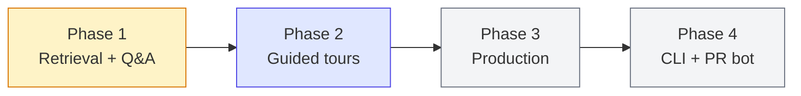
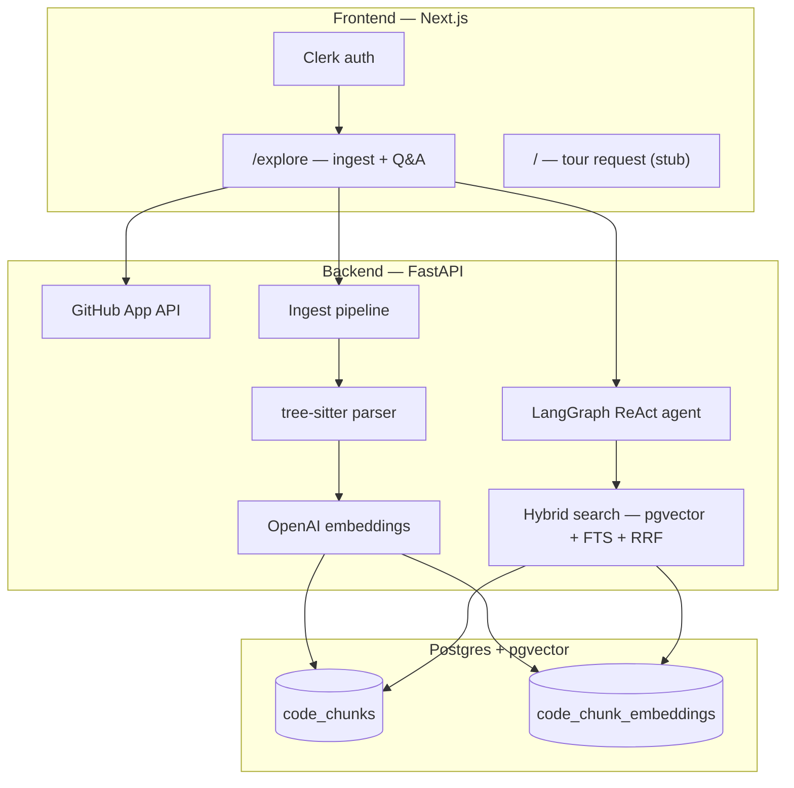

# Camino

Generate **guided tours** of unfamiliar codebases. Connect a GitHub repo, pick a topic
("authentication flow", "request lifecycle"), and get a structured walkthrough with code
snippets, file references, and explanations of *why* the code exists the way it does.

Built for new hires, OSS contributors, and anyone who's opened a repo and thought
"where do I even start?"

---

## Where we are

**Phase 1 — Retrieval engine + ask-the-codebase** · `🟡 In progress`

The core indexing and hybrid-search pipeline is **built and tuned**. A LangGraph ReAct
agent can answer natural-language questions about an ingested repo, grounded in retrieved
code chunks. The web app supports GitHub connect → ingest → Q&A on `/explore`.

What works today:

| Layer | Status |
|---|---|
| GitHub App + Clerk auth | ✅ wired end-to-end |
| Repo ingest (clone → parse → embed → index) | ✅ Python, JS, TS/TSX |
| Hybrid retrieval (pgvector + FTS + RRF) | ✅ shipped stack (exp1–5) |
| Retrieval eval harness | ✅ 20-question FastAPI golden set |
| Agent smoke eval | ✅ live agent + citation validity checks |
| Structural tour eval | ✅ schema + path/line/snippet fixture checks |
| ReAct Q&A agent | ✅ `/explore` + `/api/v1/agent/ask` |
| Guided tour generation | ❌ not started (journeys endpoint is a stub) |
| Production deploy | ❌ local dev only |

**Eval hero repo:** [FastAPI 0.115.6](https://github.com/tiangolo/fastapi). See
[Backend/eval/README.md](Backend/eval/README.md) for current harnesses and
[Backend/eval/EXPERIMENTS.md](Backend/eval/EXPERIMENTS.md) for the retrieval experiment log.

---

## Where we're heading



| Phase | Goal | Key deliverables |
|---|---|---|
| **1 — Now** | Best-in-class retrieval for code Q&A | exp1–5 shipped (0.900 hit@5); optional exp6 BGE reranker (0.950, closes q17); q03 last miss |
| **2 — Next** | Structured guided tours | Plan → Retrieve → Draft → Review pipeline, tour reader UI, shareable URLs |
| **3** | Ship to users | AWS (ECS, RDS, S3, SQS), observability (Langfuse), rate limits |
| **4 — Stretch** | Meet devs where they work | CLI (`onboard generate`), PR reviewer bot |

The north star hasn't changed: **web app first, CLI later, PR reviewer bot eventually.**

---

## Architecture (today)



---

## Quick start

**Prerequisites:** Docker, [uv](https://docs.astral.sh/uv/), Node 20+, Clerk app,
GitHub App, OpenAI API key.

```bash
# 1. Postgres + pgvector
docker compose up -d

# 2. Backend
cd Backend
cp .env.example .env   # fill in secrets
uv sync
uv run fastapi dev app/main.py --port 8000

# 3. Frontend
cd Frontend
cp .env.example .env.local
npm install
npm run dev            # http://localhost:3000
```

1. Sign in → install the GitHub App (header menu).
2. Open **Explore** → select a repo → **Process** (ingest).
3. Ask a question — the agent retrieves code and answers with citations.

Details: [Backend/README.md](Backend/README.md) · [Frontend/README.md](Frontend/README.md)

---

## Now / next 3 actions

1. **Tour generation pipeline** — replace the ReAct Q&A stub with Plan → Retrieve →
   Draft → Review → structured tour artifact.
2. **Tour reader UI** — render tour steps with syntax highlighting, TOC, and file paths
   (wire up `/tours` and the home-page journeys flow).
3. **Decide reranker in prod** — exp6 is done and off by default; ship BGE only if the
   +0.05 hit@5 justifies the latency, or leave query-time only for now.

**Retrieval status:** loop paused. exp6 (cross-encoder reranker) is complete — BGE blend
hits the ≥0.95 target and closes q17; only q03 remains. Kept optional (off by default) to
avoid prod latency. No critical blockers before Phase 2.

---

## Progress tracker

Legend: `[x]` done · `[~]` in progress · `[ ]` todo

### Indexing & retrieval (the engine)
- [x] Repo cloning via GitHub App (shallow tree walk, source-file filter)
- [x] tree-sitter parsing → symbol-level chunks (path, name, type, lines, source, signature/docstring)
- [x] Postgres + pgvector: chunks table (HNSW embedding col + tsvector col)
- [x] Embedding pipeline (OpenAI `text-embedding-3-small`, enriched NL headers)
- [x] Full-text search pipeline (identifier tokenization + OR query)
- [x] Hybrid retrieval via Reciprocal Rank Fusion (exp1–5 shipped)
- [ ] Multi-hop pass (follow imports/references)
- [~] Multi-language support — Python + JS/TS/TSX done; Go/Rust not yet

### Tour generation (the agent)
- [~] LangGraph agent — ReAct Q&A with `hybrid_search` tool works; full tour pipeline not built
- [ ] Structured tour artifact (steps: title, explanation, snippet, path, lines, "why")
- [~] Model routing — single model (`gpt-4o-mini`); no cheap/expensive split yet
- [ ] Suggested tour topics auto-generated from repo structure

### Web app
- [~] Request-a-tour form — home page UI exists; `/api/journeys` is a stub
- [x] Explore page — repo list, ingest, ask-the-codebase with source citations
- [ ] Tour reader page (syntax highlighting, TOC, file paths, navigation)
- [ ] Generation status / polling page
- [x] Clerk auth (sign-in, session JWT to backend)
- [x] GitHub App connect + repo listing
- [ ] Shareable tour URLs
- [~] Error handling — basic; needs clone-fail / repo-too-large / bad-LLM paths
- [ ] Rate limiting

### CLI (stretch)
- [ ] `onboard login` — device flow, store token locally (0600 perms)
- [ ] Custom CLI token system (cli_tokens table in Postgres)
- [ ] `onboard generate --repo --topic` — thin client, polls backend
- [ ] `onboard list --repo`

### Infra & deploy (AWS)
- [x] Local Postgres + pgvector (`docker-compose.yml`)
- [ ] ECS Fargate (task def, IAM role, security group, ALB)
- [ ] RDS Postgres + pgvector (migrated from local)
- [ ] S3 (tour artifacts + cached repo parses)
- [ ] SQS (async tour jobs: request → Postgres + SQS → worker → S3 → poll)
- [ ] CloudWatch log groups + custom metrics
- [ ] Bedrock access (≥1 LLM call routed through it)
- [ ] Secrets Manager (IAM task roles, no hardcoded keys)

### Evaluation (the differentiator)
- [x] Golden retrieval dataset (20 questions → expected files/symbols, FastAPI 0.115.6)
- [x] Retrieval eval script (hit rate, recall@k, precision@k, MRR, ablation mode)
- [x] Agent smoke eval (live ReAct path + citation parser/validator)
- [x] Structural evals (schema + path/line/snippet validators, fixture CLI — no LLM)
- [ ] LLM-as-judge (faithfulness, relevance, completeness, ordering)
- [ ] Eval suite across 2–3 repos (~35–40 questions total)
- [ ] Eval gates in CI (GitHub Actions, fail on regression)

### Observability
- [ ] Langfuse tracing on every agent run
- [ ] Cost + latency surfaced (per-tour token cost, model routing, step latency)

### Ship
- [~] README: overview, architecture, run instructions (this file)
- [~] README: eval results table (retrieval filled; LLM-as-judge pending)
- [ ] README: known limitations & failure modes
- [ ] Langfuse + CloudWatch screenshots
- [ ] Medium blog post
- [ ] Live end-to-end test (web + CLI)
- [ ] Publish

---

## Latest eval numbers

Retrieval on FastAPI 0.115.6 (20 questions, k=5) — full log in
[Backend/eval/EXPERIMENTS.md](Backend/eval/EXPERIMENTS.md):

| Metric | Baseline | Shipped (exp1+3+4+5) | +exp6 BGE rerank (optional) |
|---|---|---|---|
| Hit rate@5 | 0.800 | **0.900** | **0.950** |
| Recall@5 | 0.767 | **0.858** | **0.925** |
| MRR | 0.649 | 0.766 | 0.817 |

Shipped default (rerank off) still misses q03 (path param validation) and q17 (websocket
routes). The optional exp6 BGE reranker closes **q17**, leaving **q03** as the only miss —
its labeled chunks sit in the fused pool (vector@20 / FTS@6) but not top-5, so it needs a
larger final limit (exp7) or class-aware chunk splits (exp8), not more reranking.

Additional harnesses now available:

- Agent smoke eval: `uv run python -m eval.run_agent_smoke_eval --strict`
- Structural tour eval: `uv run python -m eval.run_structural_eval`

LLM-as-judge: _not run yet_

---

## Cut these first if behind

1. CLI · 2. Third eval repo · 3. CI eval gates · 4. LLM-as-judge

**Never cut:** README + honest failure analysis.
