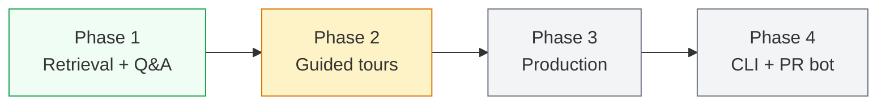
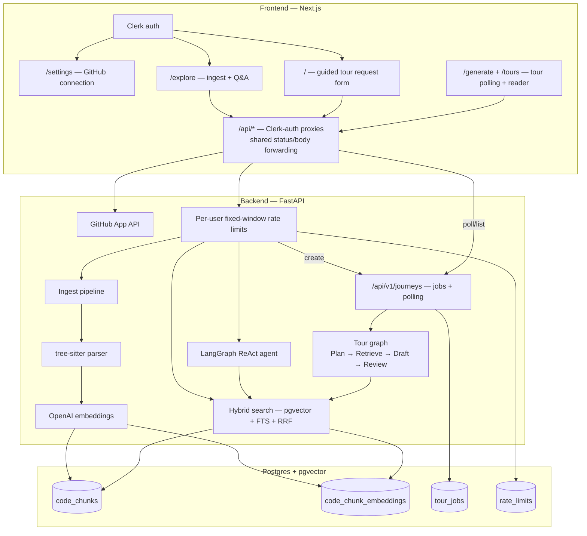
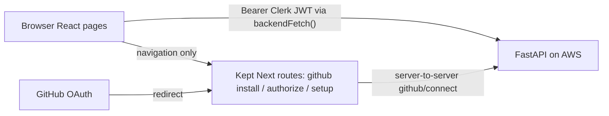

# Camino

Generate **guided tours** of unfamiliar codebases. Connect a GitHub repo, pick a topic
("authentication flow", "request lifecycle"), and get a structured walkthrough with code
snippets, file references, and explanations of *why* the code exists the way it does.

Built for new hires, OSS contributors, and anyone who's opened a repo and thought
"where do I even start?"

---

## Where we are

**Phase 2 — Guided tours** · `✅ M5 implemented`

The core indexing and hybrid-search pipeline is **built and tuned**. A LangGraph ReAct
agent can answer natural-language questions about an ingested repo, grounded in retrieved
code chunks. Phase 2 now has the full guided-tour path: a Plan → Retrieve → Draft →
Review generator, persisted journey jobs, polling/list APIs, authenticated Next.js proxies,
the `/generate` polling page, the `/tours` library, and the `/tours/{id}` reader UI.

What works today:


| Layer                                       | Status                                                    |
| ------------------------------------------- | --------------------------------------------------------- |
| GitHub App + Clerk auth                     | ✅ wired end-to-end                                        |
| Repo ingest (clone → parse → embed → index) | ✅ Python, JS, TS/TSX                                      |
| Hybrid retrieval (pgvector + FTS + RRF)     | ✅ shipped stack (exp1–5)                                  |
| Retrieval eval harness                      | ✅ 20-question FastAPI golden set                          |
| Agent smoke eval                            | ✅ live agent + citation validity checks                   |
| Structural tour eval                        | ✅ schema + path/line/snippet fixture checks               |
| LLM-as-judge tour eval                      | ✅ faithfulness/relevance/completeness/ordering + baseline |
| ReAct Q&A agent                             | ✅ `/explore` + `/api/v1/agent/ask`                        |
| Guided tour generation                      | ✅ backend pipeline + jobs/API + frontend flow             |
| Backend response forwarding                 | 🟡 shared status/body helper adopted by core proxy routes; planned: replace proxies with direct browser → FastAPI calls |
| Per-user API rate limiting                  | ✅ PostgreSQL fixed windows on costly POST routes           |
| Clerk account-deletion webhook cleanup      | ✅ idempotent, transactional local-data cleanup             |
| Production deploy                           | ❌ local dev only                                          |


**Eval hero repo:** [FastAPI 0.115.6](https://github.com/tiangolo/fastapi). See
[Backend/eval/README.md](Backend/eval/README.md) for current harnesses and
[Backend/eval/EXPERIMENTS.md](Backend/eval/EXPERIMENTS.md) for the retrieval experiment log.

---

## Where we're heading




| Phase           | Goal                                 | Key deliverables                                                                            |
| --------------- | ------------------------------------ | ------------------------------------------------------------------------------------------- |
| **1 — Done**    | Best-in-class retrieval for code Q&A | exp1–5 shipped (0.900 hit@5); optional exp6 BGE reranker (0.950, closes q17); q03 last miss |
| **2 — Now**     | Structured guided tours              | End-to-end tour generation flow built; M5 LLM-as-judge eval + failure-mode docs landed      |
| **3**           | Ship to users                        | AWS CDK, RDS PostgreSQL + pgvector, ECS Fargate, then durable jobs and observability         |
| **4 — Stretch** | Meet devs where they work            | CLI (`onboard generate`), PR reviewer bot                                                   |


The north star hasn't changed: **web app first, CLI later, PR reviewer bot eventually.**

---

## Architecture (today)



### Planned: direct browser → FastAPI calls

**Decision:** retire the Next.js `/api/*` proxy layer and have the browser call
FastAPI directly with the Clerk session JWT. With the frontend on Vercel and the
backend on AWS, the proxy provides no network isolation — the backend is publicly
reachable and must verify JWTs regardless — so the extra hop only adds a second
error-translation layer and Vercel function invocations per API call.



Scope of the migration (not yet implemented):

- Backend: add CORS (exact origins, `Retry-After` exposed) and drop `userId` from all
  paths/bodies — identity comes solely from the verified token's `sub` claim.
- Frontend: one shared `backendFetch()` helper with a typed `ApiError` that surfaces
  FastAPI `detail` strings; migrate all page call sites; delete the 8 proxy routes and
  `forwardBackendResponse`.
- Keep only the three GitHub OAuth redirect routes in Next.js (cookie/CSRF handling
  and the Clerk session live on the app's domain).

Per-app specifics are in [Frontend/README.md](Frontend/README.md) and
[Backend/README.md](Backend/README.md).

---

## Quick start

**Prerequisites:** Docker, [uv](https://docs.astral.sh/uv/), Node 20+, Clerk app,
GitHub App, OpenAI API key.

```bash
# 1. Postgres + pgvector
docker compose up -d

# 2. Backend
cd Backend
cp .env.example .env   # fill in secrets
uv sync
uv run fastapi dev app/main.py --port 8000

# 3. Frontend
cd Frontend
cp .env.example .env.local
npm install
npm run dev            # http://localhost:3000
```

1. Sign in → open **Settings** → connect or manage the GitHub App.
2. Open **Explore** → select a repo → **Process** (ingest). The repo must be indexed
  before Q&A or tour generation can use it.
3. Ask a question in **Explore**, or go back to **Home** to generate a tour:
  select the processed repo, enter a topic such as "authentication flow", and click
   **Generate tour**.
4. Camino routes to `/generate?id=...`, polls the job, then opens `/tours/{id}` when
  the grounded tour is ready.

Details: [Backend/README.md](Backend/README.md) · [Frontend/README.md](Frontend/README.md) ·
[Backend/eval/README.md](Backend/eval/README.md)

---

## AWS deployment plan

**Decision:** provision Camino's AWS infrastructure with **AWS CDK in TypeScript**.
Keep the infrastructure in an `Infrastructure/` CDK app with two independently
deployable stacks:

1. **`CaminoDatabaseStack`** — VPC, isolated database subnets, security groups,
   Secrets Manager credentials, and RDS PostgreSQL with pgvector support.
2. **`CaminoBackendStack`** — ECR image, ECS Fargate service, public HTTPS
   Application Load Balancer, CloudWatch logs, task roles, and backend secrets.

The backend stack depends on outputs from the database stack, but the database can be
deployed first:

```bash
cd Infrastructure
npm ci
npx cdk bootstrap
npx cdk deploy CaminoDatabaseStack
# After the backend image, migrations, health check, and secrets are ready:
npx cdk deploy CaminoBackendStack
```

### Private-alpha topology

- Run RDS in isolated subnets with `publiclyAccessible: false`; only the ECS task
  security group may connect to port 5432.
- Run the internet-facing ALB in public subnets. For the initial cost-conscious alpha,
  Fargate tasks may use public subnets/public IPs while allowing inbound traffic only
  from the ALB security group. This avoids a NAT Gateway while preserving the outbound
  access required by GitHub and OpenAI.
- Terminate TLS at the ALB with ACM and Route 53. Do not expose the ECS container port
  directly.
- Generate database credentials in Secrets Manager and inject application secrets into
  the task definition. Never put secret values in CDK source, CloudFormation outputs, or
  committed environment files.
- Start with one Fargate task because tour generation currently uses in-process FastAPI
  `BackgroundTasks`. A deployment can interrupt an active tour until SQS/worker recovery
  is implemented.

### Deployment gates

Before the first backend deployment:

- [ ] Validate that a submitted GitHub installation belongs to the authenticated GitHub user.
- [~] Revoke the external GitHub App authorization during account deletion; Clerk already provides the authenticated, confirmed deletion flow and webhook-driven local cleanup.
- [ ] Add a production backend Dockerfile and pinned production start command.
- [ ] Add `/health` and readiness behavior for the ALB.
- [ ] Add Alembic and commit an initial schema migration, including `vector` and indexes.
- [ ] Run migrations as a one-off ECS task; do not run schema creation in every web task.
- [ ] Add explicit LLM timeouts and repository-size/file-count limits.
- [ ] Define recovery for tour jobs left `pending` or `generating` after a task restart.
- [ ] Add CI checks for backend tests, frontend lint/build, CDK synthesis, and migrations.
- [ ] Run a deployed smoke test: auth → GitHub connect → ingest → ask → generate tour.

Account deletion is initiated through Clerk's authenticated UserButton security UI,
which requires the user to type `Delete account` before continuing. Clerk deletes the
identity and sends a verified `user.deleted` webhook. The webhook performs idempotent,
transactional cleanup of the user's profile, encrypted GitHub connection, tours/jobs and
artifacts, and rate-limit records. It deletes indexed chunks and their cascading
embeddings only when no other Camino connection references the same GitHub installation,
so a shared installation is preserved. Failures roll back and return `500` so Clerk can
retry safely.

Camino does not need a separate delete endpoint or confirmation UI for this Clerk-driven
flow. The remaining deletion work is to uninstall or revoke the external GitHub App
authorization; removing Camino's encrypted connection prevents further local use but
does not revoke access at GitHub. Repository-level ownership within an installation also
needs an explicit policy before shared repositories are supported. Webhook cleanup and
retry behavior are covered by backend tests. Any retained deletion audit record must be
minimal and non-identifying.

The first alpha may use Single-AZ RDS and one ECS task. Multi-AZ RDS, private Fargate
tasks with managed egress, autoscaling, SQS workers, and S3 artifact storage are
post-alpha reliability upgrades.

---

## Now / next 3 actions

1. **Create the CDK database stack** — VPC, isolated subnets, RDS PostgreSQL,
   Secrets Manager, backups, and ECS-only database access.
2. **Prepare the backend for Fargate** — fix GitHub installation ownership, add the
   production image and health endpoint, and introduce Alembic migrations.
3. **Create the CDK backend stack** — ECR, Fargate, ALB/HTTPS, CloudWatch logs,
   secrets injection, CI synthesis, and a live end-to-end smoke test.

**Retrieval status:** loop paused. exp6 (cross-encoder reranker) is complete — BGE blend
hits the ≥0.95 target and closes q17; only q03 remains. Kept optional (off by default) to
avoid prod latency. No critical retrieval blockers for the current Phase 2 eval work.

---

## Progress tracker

Legend: `[x]` done · `[~]` in progress · `[ ]` todo

### Indexing & retrieval (the engine)

- [x] Repo cloning via GitHub App (shallow tree walk, source-file filter)
- [x] tree-sitter parsing → symbol-level chunks (path, name, type, lines, source, signature/docstring)
- [x] Postgres + pgvector: chunks table (HNSW embedding col + tsvector col)
- [x] Embedding pipeline (OpenAI `text-embedding-3-small`, enriched NL headers)
- [x] Full-text search pipeline (identifier tokenization + OR query)
- [x] Hybrid retrieval via Reciprocal Rank Fusion (exp1–5 shipped)
- [ ] Multi-hop pass (follow imports/references)

- [~] Multi-language support — Python + JS/TS/TSX done; Go/Rust not yet

### Tour generation (the agent)

- [x] LangGraph Q&A agent — ReAct with `hybrid_search` tool works on `/explore`
- [x] Tour graph — Plan → Retrieve → Draft → Review with bounded repair loop
- [x] Structured tour artifact (steps: title, explanation, snippet, path, lines, "why")
- [x] Deterministic grounding — snippets/path/lines extracted from retrieved chunks
- [x] Journey persistence/API — `tour_jobs`, `POST /api/v1/journeys`, `GET /{id}`, `GET ?repo=`

- [~] Model routing — single model (`gpt-4o-mini`); no cheap/expensive split yet

- [ ] Suggested tour topics auto-generated from repo structure

### Web app

- [x] Request-a-tour form — select repo, enter topic, create journey, route to `/generate`
- [x] Explore page — repo list, ingest, ask-the-codebase with source citations
- [x] Tour reader page — TOC, markdown explanations, file paths, line-numbered snippets
- [x] Generation status / polling page
- [x] Tours library page
- [x] Settings page — GitHub connection status plus install/manage-repositories entry point
- [x] Clerk auth (sign-in, session JWT to backend)
- [x] GitHub App connect + repo listing
- [~] Account deletion — Clerk provides authenticated typed confirmation and identity deletion, and the verified webhook removes local data; external GitHub App revocation remains
- [ ] Shareable tour URLs

- [~] Error handling — tour flow (`/`, `/generate`, `/tours`, `/tours/{id}`) surfaces expired-session (401/403), not-found (404), and backend errors distinctly; still needs clone-fail / repo-too-large / bad-LLM paths

- [~] Shared BFF proxy/auth wrapper — superseded by the planned direct browser → FastAPI migration; `forwardBackendResponse` and the proxy routes will be removed rather than extended (see Architecture → Planned)
- [ ] Direct browser → FastAPI migration — backend CORS + token-derived identity (drop `userId` params), shared `backendFetch`/`ApiError` client helper, migrate 6 pages, delete 8 proxy routes; keep GitHub OAuth redirect routes
- [x] Per-user PostgreSQL fixed-window rate limiting for agent Q&A, ingest, direct search, and journey creation; proxies preserve `429` and `Retry-After`

### CLI (stretch)

- [ ] `onboard login` — device flow, store token locally (0600 perms)
- [ ] Custom CLI token system (cli_tokens table in Postgres)
- [ ] `onboard generate --repo --topic` — thin client, polls backend
- [ ] `onboard list --repo`

### Infra & deploy (AWS)

- [x] Local Postgres + pgvector (`docker-compose.yml`)
- [x] Infrastructure-as-code decision: AWS CDK with TypeScript
- [ ] `Infrastructure/` CDK app with separate database and backend stacks
- [ ] VPC: public ALB/Fargate subnets for private alpha plus isolated RDS subnets
- [ ] RDS PostgreSQL + pgvector, encrypted storage, backups, Secrets Manager credentials
- [ ] Alembic baseline and one-off ECS migration task
- [ ] Backend production Dockerfile, ECR repository, and pinned start command
- [ ] ECS Fargate service (task/execution roles, security groups, desired count 1)
- [ ] ALB health check, ACM certificate, HTTPS listener, and Route 53 record
- [ ] CloudWatch application logs, retention policy, alarms, and request correlation
- [ ] CI: tests, frontend build/lint, Docker build, CDK synth, and migration validation
- [ ] S3 (tour artifacts + cached repo parses)
- [ ] SQS (async tour jobs: request → Postgres + SQS → worker → S3 → poll)
- [ ] Bedrock access (≥1 LLM call routed through it)

### Evaluation (the differentiator)

- [x] Golden retrieval dataset (20 questions → expected files/symbols, FastAPI 0.115.6)
- [x] Retrieval eval script (hit rate, recall@k, precision@k, MRR, ablation mode)
- [x] Agent smoke eval (live ReAct path + citation parser/validator)
- [x] Structural evals (schema + path/line/snippet validators, fixture CLI — no LLM)
- [x] Tour route tests (`POST`, poll, list, auth/ownership, DB failures)
- [x] LLM-as-judge (faithfulness, relevance, completeness, ordering) + committed baseline
- [ ] Eval suite across 2–3 repos (~35–40 questions total)
- [ ] Eval gates in CI (GitHub Actions, fail on regression)

### Observability

- [ ] Langfuse tracing on every agent run
- [ ] Cost + latency surfaced (per-tour token cost, model routing, step latency)

### Ship

- [x] README: overview, architecture, run instructions (this file)
- [x] README: eval results table (retrieval + LLM-as-judge filled)
- [x] README: known limitations & failure modes (tour doc §12)
- [ ] Langfuse + CloudWatch screenshots
- [ ] Medium blog post
- [ ] Live end-to-end test (web + CLI)
- [ ] Publish

---

## Latest eval numbers

Retrieval on FastAPI 0.115.6 (20 questions, k=5) — full log in
[Backend/eval/EXPERIMENTS.md](Backend/eval/EXPERIMENTS.md):


| Metric     | Baseline | Shipped (exp1+3+4+5) | +exp6 BGE rerank (optional) |
| ---------- | -------- | -------------------- | --------------------------- |
| Hit rate@5 | 0.800    | **0.900**            | **0.950**                   |
| Recall@5   | 0.767    | **0.858**            | **0.925**                   |
| MRR        | 0.649    | 0.766                | 0.817                       |


Shipped default (rerank off) still misses q03 (path param validation) and q17 (websocket
routes). The optional exp6 BGE reranker closes **q17**, leaving **q03** as the only miss —
its labeled chunks sit in the fused pool (vector@20 / FTS@6) but not top-5, so it needs a
larger final limit (exp7) or class-aware chunk splits (exp8), not more reranking.

Additional harnesses now available:

- Agent smoke eval: `uv run python -m eval.run_agent_smoke_eval --strict`
- Structural tour eval: `uv run python -m eval.run_structural_eval`
- Live tour smoke eval: `uv run python -m eval.run_tour_smoke_eval`
- LLM-as-judge tour eval: `uv run python -m eval.run_tour_judge_eval`

Tour quality (LLM-as-judge, FastAPI 0.115.6, 3 topics, `gpt-4o-mini`) — baseline in
[Backend/eval/judge_baseline.json](Backend/eval/judge_baseline.json):


| Dimension    | Avg (1–5) |
| ------------ | --------- |
| Faithfulness | 4.95      |
| Relevance    | 4.81      |
| Completeness | 3.67      |
| Ordering     | 4.33      |
| **Overall**  | **4.44**  |


Completeness is the weakest dimension — expected, since snippets are grounded by
construction while topic *coverage* is the hard part. See failure modes in
[docs/tour-generation.md](docs/tour-generation.md) §12.

---

## Cut these first if behind

1. CLI · 2. Third eval repo · 3. CI eval gates

**Never cut:** README + honest failure analysis.