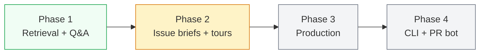
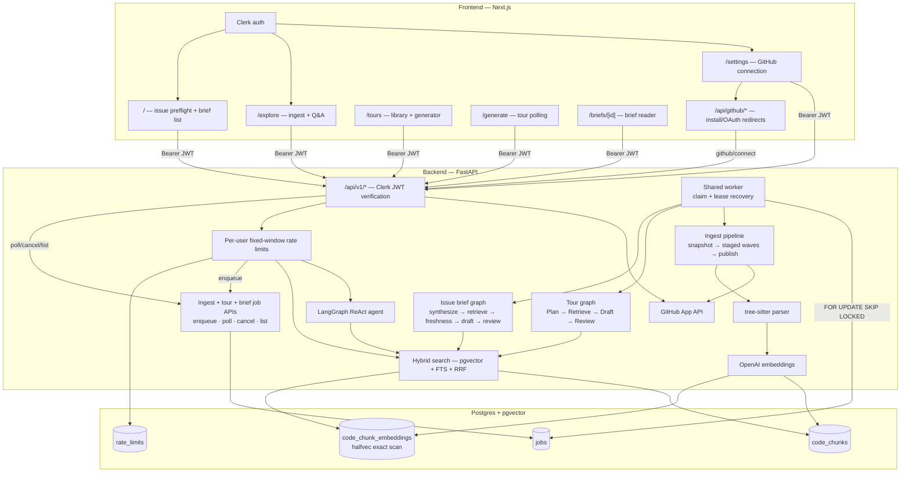
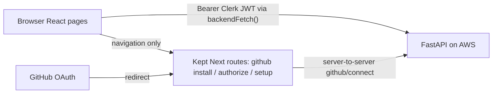

# Camino

**Solve your first issue.** Camino is an open source contribution tool: paste a GitHub
issue URL and get a **grounded implementation brief**. It checks contribution signals
(assignees, open PRs, maintainer instructions), finds the right target branch, and maps
the setup, code reading, tests, and implementation steps needed to land the change.

Issue orientation is the product, at `/briefs`; `/` is a landing page for new visitors.
Two supporting tools help when you
need more context on the repository behind the issue: ask-the-codebase Q&A on
`/explore` and guided code tours on `/tours`.

Built for OSS contributors and anyone who's opened an issue and thought, "where do I
even start?"

---

## Where we are

**Phase 2 — Issue briefs + supporting tours** · `✅ M6 implemented`

The contribution flow is end to end: the briefs workbench previews a GitHub issue thread,
surfaces warnings, discovers the repository's preferred target branch, indexes code by
ref, and turns the issue into a grounded, cancellable implementation brief. Underneath
it, the core indexing and hybrid-search pipeline is **built and tuned**, and a durable
shared Postgres job queue backs ingestion, briefs, and tours with polling, cancellation,
and list APIs plus authenticated direct browser calls. The supporting context tools are
also complete: a LangGraph ReAct agent answers natural-language questions about an
ingested repo on `/explore`, and the Plan → Retrieve → Draft → Review tour generator
drives the `/tours` library, `/generate` polling page, and `/tours/{id}` reader.

What works today:


| Layer                                       | Status                                                    |
| ------------------------------------------- | --------------------------------------------------------- |
| GitHub issue briefs                         | ✅ preflight + branch discovery + grounded brief reader    |
| GitHub App + Clerk auth                     | ✅ wired end-to-end                                        |
| Repo ingest (snapshot → parse → embed → publish) | ✅ queued, bounded, ref-aware Python/JS/TS/TSX indexing |
| Hybrid retrieval (halfvec exact scan + FTS + RRF) | ✅ shipped stack (exp1–5, exp7/8 storage validation) |
| Retrieval eval harness                      | ✅ 20-question FastAPI golden set                          |
| Agent smoke eval                            | ✅ live agent + citation validity checks                   |
| Structural tour eval                        | ✅ schema + path/line/snippet fixture checks               |
| LLM-as-judge tour eval                      | ✅ faithfulness/relevance/completeness/ordering + baseline |
| ReAct Q&A agent                             | ✅ `/explore` + `/api/v1/agent/ask`                        |
| Guided tour generation                      | ✅ backend pipeline + jobs/API + frontend flow             |
| Durable background-job execution            | ✅ shared Postgres queue, leases, retries, and cancellation |
| Direct browser API access                   | ✅ Clerk JWT calls from React pages to FastAPI              |
| Per-user API rate limiting                  | ✅ PostgreSQL fixed windows on costly API operations        |
| Clerk account-deletion webhook cleanup      | ✅ idempotent, transactional local-data cleanup             |
| GitHub installation webhook cleanup         | ✅ removes local data when an installation is deleted       |
| Production deploy                           | ❌ local dev only                                          |


**Eval hero repo:** [FastAPI 0.115.6](https://github.com/tiangolo/fastapi). See
[Backend/eval/README.md](Backend/eval/README.md) for current harnesses and
[Backend/eval/EXPERIMENTS.md](Backend/eval/EXPERIMENTS.md) for the retrieval experiment log.

---

## Where we're heading


```mermaid
flowchart LR
  P1["Phase 1<br/>Retrieval + Q&A"] --> P2["Phase 2<br/>Issue briefs + tours"]
  P2 --> P3["Phase 3<br/>Production"]
  P3 --> P4["Phase 4<br/>CLI + PR bot"]

  style P1 fill:#f0fdf4,stroke:#16a34a
  style P2 fill:#fef3c7,stroke:#d97706
  style P3 fill:#f3f4f6,stroke:#6b7280
  style P4 fill:#f3f4f6,stroke:#6b7280
```


| Phase           | Goal                                 | Key deliverables                                                                            |
| --------------- | ------------------------------------ | ------------------------------------------------------------------------------------------- |
| **1 — Done**    | Best-in-class retrieval for code Q&A | exp1–5 shipped (0.900 hit@5); optional exp6 BGE reranker (0.950, closes q17); q03 last miss |
| **2 — Now**     | Issue briefs + supporting tours      | End-to-end brief/tour flows, M5 evals, and M6 durable Postgres queue landed                   |
| **3**           | Ship to users                        | Single EC2 box + Docker Compose (Caddy, API, workers), RDS PostgreSQL + pgvector, health checks, CI, deployed smoke test |
| **4 — Stretch** | Meet contributors where they work    | CLI (`camino brief`), PR reviewer bot                                                       |


The north star: **the issue-to-brief web app first, CLI later, PR reviewer bot
eventually.**

---

## Architecture (today)


```mermaid
flowchart TB
  subgraph frontend [Frontend — Next.js]
    Clerk[Clerk auth]
    Settings["/settings — GitHub connection"]
    Explore["/explore — ingest + Q&A"]
    Home["/ — issue preflight + brief list"]
    TourUI["/tours — library + generator"]
    GenerateUI["/generate — tour polling"]
    BriefUI["/briefs/[id] — brief reader"]
    GithubRoutes["/api/github/* — install/OAuth redirects"]
  end

  subgraph backend [Backend — FastAPI]
    API["/api/v1/* — Clerk JWT verification"]
    GH[GitHub App API]
    Ingest["Ingest pipeline<br/>snapshot → staged waves → publish"]
    Parser[tree-sitter parser]
    Embed[OpenAI embeddings]
    Search[Hybrid search — pgvector + FTS + RRF]
    Agent[LangGraph ReAct agent]
    JobAPIs["Ingest + tour + brief job APIs<br/>enqueue · poll · cancel · list"]
    Worker["Shared worker<br/>claim + lease recovery"]
    TourGraph["Tour graph<br/>Plan → Retrieve → Draft → Review"]
    BriefGraph["Issue brief graph<br/>synthesize → retrieve → freshness → draft → review"]
    Limits["Per-user fixed-window rate limits"]
  end

  subgraph data [Postgres + pgvector]
    Chunks[(code_chunks)]
    Vectors[(code_chunk_embeddings<br/>halfvec exact scan)]
    Jobs[(jobs)]
    Counters[(rate_limits)]
  end

  Clerk --> Settings
  Clerk --> Explore
  Clerk --> Home
  Settings -->|"Bearer JWT"| API
  Explore -->|"Bearer JWT"| API
  Home -->|"Bearer JWT"| API
  TourUI -->|"Bearer JWT"| API
  GenerateUI -->|"Bearer JWT"| API
  BriefUI -->|"Bearer JWT"| API
  Settings --> GithubRoutes
  GithubRoutes -->|github/connect| API
  API --> GH
  API --> Limits
  Limits --> Agent
  Limits --> Search
  Limits -->|enqueue| JobAPIs
  API -->|poll/cancel/list| JobAPIs
  Limits --> Counters
  Ingest --> GH
  Ingest --> Parser --> Embed --> Chunks
  Embed --> Vectors
  Agent --> Search
  JobAPIs --> Jobs
  Worker -->|"FOR UPDATE SKIP LOCKED"| Jobs
  Worker --> Ingest
  Worker --> TourGraph
  Worker --> BriefGraph
  TourGraph --> Search
  BriefGraph --> Search
  Search --> Chunks
  Search --> Vectors
```

### Direct browser → FastAPI calls

The Next.js data proxy layer has been retired. The browser calls
FastAPI directly with the Clerk session JWT. With the frontend on Vercel and the
backend on AWS, the proxy provides no network isolation — the backend is publicly
reachable and must verify JWTs regardless — so the extra hop only adds a second
error-translation layer and Vercel function invocations per API call.


```mermaid
flowchart LR
  Browser[Browser React pages] -->|"Bearer Clerk JWT via backendFetch()"| FastAPI[FastAPI on AWS]
  Browser -->|navigation only| GithubRoutes["Kept Next routes: github install / authorize / setup"]
  GithubRoutes -->|"server-to-server github/connect"| FastAPI
  GitHubOAuth[GitHub OAuth] -->|redirect| GithubRoutes
```

Implementation status:

- Backend: CORS is configured, and `userId` has been removed from every API
  path/body; identity comes solely from the verified token's `sub` claim. Legacy paths
  return `404`, and legacy body fields return `422`.
- Frontend: `backendFetch()` and `ApiError` attach the Clerk token and surface FastAPI
  `detail` strings; authenticated product pages call FastAPI directly.
- Only the three GitHub OAuth redirect routes remain in Next.js (cookie/CSRF handling
  and the Clerk session live on the app's domain).

Per-app specifics are in [Frontend/README.md](Frontend/README.md) and
[Backend/README.md](Backend/README.md).

---

## Quick start

**Prerequisites:** Docker, [uv](https://docs.astral.sh/uv/), Python 3.14+, Node 20+,
Clerk app, GitHub App, OpenAI API key.

```bash
# 1. Postgres + pgvector
docker compose up -d

# 2. Backend
cd Backend
cp .env.example .env   # fill in secrets
uv sync
uv run fastapi dev app/main.py --port 8000

# 3. Worker (in a second terminal)
cd Backend
uv run python -m app.worker

# 4. Frontend
cd ../Frontend
cp .env.example .env.local
npm install
npm run dev            # http://localhost:3000
```

Instead of the standalone worker command, you can run the supervised Compose worker
from the repository root with `docker compose --profile worker up -d worker`. With
`RUN_WORKER=false` by default, ingestion, tour, and issue-brief jobs remain queued
unless either worker option is running.

The defaults expect the frontend at `http://localhost:3000` and FastAPI at
`http://127.0.0.1:8000`. Browser origins are matched exactly: if you open the frontend
at `http://127.0.0.1:3000` or another origin, add that exact value to the backend's
`CORS_ORIGINS`.

### Clerk and GitHub App configuration

- GitHub App callback URL: `{NEXT_PUBLIC_APP_URL}/api/github/authorize`
- GitHub App setup URL: `{NEXT_PUBLIC_APP_URL}/api/github/setup` with **Redirect on
  update** enabled
- GitHub App webhook URL: `{public-backend-origin}/webhooks/github`, with the webhook
  set to **Active**. No event subscription is needed: GitHub sends every App the
  `installation` events (delete, suspend, unsuspend) and the
  `github_app_authorization` event (revoked) that the backend handles
- Clerk webhook URL: `{public-backend-origin}/webhooks/clerk`, subscribed to
  `user.created`, `user.updated`, and `user.deleted` (the backend syncs local user
  profiles from the first two and runs account cleanup on the third)

Clerk and GitHub cannot reach localhost webhooks directly; use a tunnel such as ngrok
or Cloudflare Tunnel when testing deletion flows locally. The install route targets the
GitHub App slug configured via the required `GITHUB_APP_SLUG` environment variable
(e.g. `camino-onboarder`).

Startup creates missing tables and provisions pgvector, custom indexes, and the
`live_code_chunks` view. Embeddings default to `halfvec(1536)` with exact scans and no
HNSW index. The API and standalone worker validate that the configured embedding type
matches the database, but they do not migrate an older schema. A database created with
the former `vector(1536)` default, or before the shared `jobs` table and
generation-based indexes, must be recreated for local development or upgraded with the
explicit migration in [Backend/README.md](Backend/README.md#local-db-created-before-2026-09).
`SQLModel.metadata.create_all()` does not add, rename, or remove columns on existing
tables.

1. Sign in → open **Settings** → connect or manage the GitHub App.
2. On **Home**, paste a GitHub issue URL, review the issue warnings and discovered
   target branch, then generate a brief. Camino queues the required ref ingestion
   automatically, if needed, before producing setup steps, grounded reading guidance,
   tests, and an implementation checklist.
3. For more repository context, open **Explore** → select a repo → **Process**. Camino
   queues ingestion and polls its status; **Stop** cancels an active job. Indexes are
   scoped to the selected ref, private repositories are rejected, and the repo must be
   indexed before Q&A or tour
   generation can use it.
4. Ask a question in **Explore**, or open **Tours** to generate a tour: select the
   processed repo, enter a topic such as "authentication flow", and click
   **Generate tour**. Camino routes to `/generate?id=...`, polls the job, then opens
   `/tours/{id}` when the grounded tour is ready.

Details: [Backend/README.md](Backend/README.md) · [Frontend/README.md](Frontend/README.md) ·
[Backend/eval/README.md](Backend/eval/README.md)

---

## Tests

```bash
# Backend: quick, secret-free feedback (Postgres integration tests may skip)
cd Backend
uv run pytest

# Backend: complete pre-merge suite (Docker required; zero skips expected)
./scripts/test_all.sh

# Frontend
cd ../Frontend
npm test
npm run lint
```

Backend coverage includes API/auth behavior, webhook cleanup, rate limiting, retrieval,
ref-aware staged ingestion, tour and issue-brief generation/cancellation, contribution
target discovery, shared-job lifecycle, and startup schema provisioning. The complete
backend command provisions and removes an isolated pgvector database for real concurrent
claim/recovery tests; never point `TEST_DATABASE_URL` at the development or eval
database because those tests truncate tables. See [Backend testing](Backend/README.md#tests)
for the workflow and manual CI configuration. Frontend Vitest coverage exercises the
shared direct-to-FastAPI client plus queued-ingestion polling, timeout, cancellation,
and error behavior, plus contribution-target and issue-brief clients.

---

## Deployment plan: EC2 + Docker Compose

> **Decision (2026-09, supersedes the earlier CDK/ECS Fargate plan):** Camino
> launches on a **single EC2 instance running Docker Compose**. At launch the user
> base is one person, the eventual target is a low couple hundred users, and an
> always-on Fargate + ALB topology (~$95/mo) is not justified at that scale. The
> real variable cost is OpenAI tokens, not compute. ECS/CDK remains the post-alpha
> upgrade path if usage ever demands it.
>
> **Database decision (2026-09-17):** the storage capacity ceiling, the halfvec
> embedding shrink, and the move to RDS `db.t4g.micro` are planned in
> [docs/storage-capacity-plan.md](docs/storage-capacity-plan.md). Neon was dropped
> on 2026-09-23; development runs on local Postgres until the RDS instance exists.

### Target topology (~$33/mo)

- **EC2 `t4g.small`** (2 vCPU ARM, 2 GB RAM, ~$19/mo) running Docker Compose:
  Caddy (TLS + reverse proxy), the FastAPI API container with `RUN_WORKER=false`,
  and 1–2 dedicated worker containers with an always-restart policy. Images must be
  built for **arm64**. RAM is the sizing constraint — workers held ~290 MiB each and
  the RAM/latency gates passed reproducibly in the load test
  ([docs/t4g-loadtest.md](docs/t4g-loadtest.md)).
- **RDS PostgreSQL `db.t4g.micro`**, single-AZ, 20 GB gp3 (~$14/mo) with pgvector,
  encrypted storage, and automated backups, reachable only from the instance's
  security group. Only <0.5 MB of the database (users, connections, jobs, brief
  artifacts) is irreplaceable; chunks and embeddings are a rebuildable cache
  (~$0.25/repo to re-ingest).
- **Frontend stays on Vercel.** The browser calls the backend directly with Clerk
  JWTs, so the backend needs a real domain and certificate (Route 53 + Caddy's
  automatic TLS) and the Vercel origin in `CORS_ORIGINS`.
- **Worker replicas are the throughput knob.** Jobs are I/O-bound (GitHub/OpenAI
  calls) and the Postgres queue (`FOR UPDATE SKIP LOCKED` + leases) already
  supports concurrent workers, so scaling is adding worker containers, not
  resizing the box.
- No production credentials exist yet. Define the production provisioning
  procedure before creating them.
- Jobs are claimed from Postgres, so more than one worker can share the queue. A killed
  worker leaves its current job in `running` until the 600-second lease expires and
  recovery requeues or fails it. Active jobs renew their lease every one-third of the
  lease timeout (200 seconds with the defaults), independently of empty-queue polling.

### Deployment gates

Before the first backend deployment:

- [x] Validate that a submitted GitHub installation belongs to the authenticated GitHub user.
- [~] Revoke the external GitHub App authorization during account deletion; Clerk already provides the authenticated, confirmed deletion flow and webhook-driven local cleanup.
- [ ] Add a production backend Dockerfile (arm64) and pinned production start command.
- [ ] Add a production Compose file: Caddy, API (`RUN_WORKER=false`), worker replicas,
  healthchecks, and restart policies.
- [ ] Add `/health` and wire it into the Compose healthchecks and Caddy.
- [ ] Add Alembic and commit an initial schema migration, including `halfvec` and indexes.
- [ ] Run migrations as an explicit one-off step (`docker compose run`); do not run
  schema creation on every app start.
- [~] Add explicit LLM timeouts and a parsed source-file-count limit; compressed
  tarballs, expanded archive bytes, archive entries, and generated chunks are capped.
- [x] Recover shared jobs left `running` after a task restart with expiring leases,
  bounded attempts, and periodic requeue/fail sweeps.
- [ ] Add CI checks for backend tests, frontend lint/build, the arm64 image build, and
  migrations.
- [ ] Provision the RDS instance and production secrets after documenting the
  production provisioning procedure.
- [ ] Run a deployed smoke test: auth → GitHub connect → ingest → ask → generate tour
  → generate issue brief.
- [ ] Register `https://<backend>/webhooks/clerk` for Clerk user lifecycle events
  (`user.created`, `user.updated`, `user.deleted`) and
  `https://<backend>/webhooks/github` for GitHub installation and
  authorization-revoked events.

### Pre-deployment checklist: security & operations

A walk-through list, separate from the build gates above. Each item must be
explicitly checked (not assumed) before real users touch the deployment.

- [~] **Authorization: a logged-in user can only access their own data.**
  Identity comes solely from the verified Clerk JWT `sub` claim, and job, brief,
  journey, connection, and follow queries filter on the authenticated user with
  ownership checks. GitHub connect also verifies the submitted installation against
  the authenticated GitHub user's installations before writing it. Remaining: do a
  final route-by-route audit that every read and write is user-scoped.
- [~] **Validate and sanitize all user inputs (SQL injection, XSS, …).**
  SQL goes through SQLModel or parameterized `text()` bind params — no string
  interpolation. Request bodies are Pydantic models, several with
  `extra="forbid"`. LLM/markdown output renders via `react-markdown` with no
  `rehype-raw` and no `dangerouslySetInnerHTML`, so raw HTML is escaped.
  Remaining: constrain `repoName` (#28) and sweep the other unconstrained
  string fields for length/shape limits.
- [~] **CORS policy configured.** Exact-origin matching is implemented; at
  deploy time set `CORS_ORIGINS` to exactly the production Vercel origin and
  confirm no wildcard or localhost entries ship.
- [~] **Rate limiting on all API endpoints.** Per-user fixed windows cover the
  costly operations (agent Q&A, ingest, follows that queue an ingest, direct
  search, contribution-target discovery, journey creation, brief
  preview/creation) with `429` + `Retry-After`. Remaining: decide per endpoint for the currently unlimited
  routes (e.g. the GitHub connection endpoints in `github.py`) so nothing is
  accidentally unmetered. Redis-backed limiting (#36) is post-launch.
- [ ] **Auth-flow expiry (password reset, sessions).** Clerk owns passwords,
  reset links, and sessions. Walk the Clerk dashboard before launch: reset-link
  and magic-link expiry, session lifetime and revocation, and bot/abuse
  protection on the sign-up flow. Document the chosen settings.
- [ ] **Client-side error screens — users never see a raw stack trace.**
  Today the frontend has no `error.tsx`, `global-error.tsx`, or `not-found.tsx`
  anywhere. Add per-route error boundaries plus a global catch-all, and map
  `ApiError` statuses to distinct screens: expired session (401 → re-auth),
  not found (404), rate limited (429 with retry guidance), and a generic
  "something broke" fallback for 5xx/unexpected errors.
- [~] **Indexes on the most common data operations.** Startup provisions the
  tuned retrieval indexes (halfvec exact scan by design, FTS/tsvector, the
  generation-based indexes) — the hot read path is covered by the exp1–8 work.
  No users yet, so the rest is educated guesses to re-check with production
  telemetry: the job-queue claim path and the rate-limit counter lookups.
- [~] **Production logging to debug incidents.** Stdlib logging exists but
  there is no production config. Define log level, timestamps, and a request
  correlation ID; ship container logs off the box with a retention policy
  (gate above) so a crashed container's logs survive it.
- [ ] **Alerts when something breaks.** Nothing today. Start small: alarm on
  health-check failure, sustained 5xx rate, worker job-failure rate, and
  disk/RAM pressure on the instance.
- [ ] **Rollback when a deploy goes wrong.** Deploy immutable, versioned image
  tags (never `latest`) so rollback is redeploying the previous tag.
  Investigate blue-green on a single box: bring up the new Compose stack
  alongside the old one and swap the Caddy upstream, falling back to tag
  rollback (brief downtime) if that's too heavy for the alpha. Alembic
  migrations must stay backward-compatible one release back so old code runs
  against the new schema during a rollback.

### Pre-deployment checklist: compliance, data retention & governance

- [ ] **Privacy policy + terms of service published.** Required by GitHub's App
  policies and expected for the Clerk/OpenAI integrations. Must disclose what
  is stored (Clerk profile sync, GitHub connection metadata, indexed code,
  briefs/tours/jobs), that repository code is sent to OpenAI for embeddings and
  generation, and the subprocessor list (Clerk, GitHub, OpenAI, AWS, Vercel).
  Set an age minimum and governing law in the terms. Cookies today are
  strictly-necessary Clerk session cookies with no analytics, so no consent
  banner is needed — revisit if analytics are ever added.
- [~] **Right to erasure (user data deletion).** Already strong: Clerk's typed
  confirmation → verified `user.deleted` webhook → idempotent transactional
  cleanup, with installation-sharing rules. Remaining: external GitHub App
  revocation (gate above), and disclose in the privacy policy that deleted data
  persists in database backups until the backup window rotates.
- [ ] **Data access/export (portability).** No way today for a user to get
  their data out. Minimal acceptable answer: briefs and tours are readable
  in-app; a JSON export endpoint is a cheap later add. Decide and document.
- [ ] **Data inventory + retention policy.** Write down every store and give
  each an explicit retention rule:
  - *Personal data:* Clerk profile sync, GitHub connection metadata,
    rate-limit counters (prune expired windows), logs (retention set in the ops
    checklist — and never log tokens; avoid logging IPs unless needed).
  - *Product artifacts:* jobs/briefs/tours — decide how long terminal
    (failed/cancelled/completed) job rows and artifacts are kept.
  - *Rebuildable cache:* chunks/embeddings — an eviction policy for stale refs
    and unfollowed repos doubles as the storage-capacity lever
    ([docs/storage-capacity-plan.md](docs/storage-capacity-plan.md)).
- [ ] **Third-party data handling verified.** Confirm current OpenAI API
  retention/training terms (API data is not used for training by default) and
  Clerk's data processing terms; cite both in the privacy policy.
- [ ] **GitHub App permissions minimized.** Audit the App to least privilege
  (read-only contents/metadata/issues) before strangers install it; every
  granted scope is something the privacy policy has to answer for.
- [ ] **Backups that actually restore.** RDS automated backups plus one tested
  restore drill before launch; note the backup window as the accepted RPO. An
  untested backup is not a backup.
- [~] **Encryption everywhere.** GitHub user OAuth tokens are not persisted;
  RDS encrypted storage is planned (gate above). Remaining: require TLS on the
  app→RDS connection and confirm no plaintext listener.
- [ ] **Operator account hardening (the real biggest risk for a solo project).**
  MFA on the AWS root/IAM, GitHub, Clerk, and OpenAI accounts; SSM Session
  Manager or key-only SSH for the EC2 box; no long-lived AWS access keys on
  laptops.
- [ ] **Dependency and image scanning.** Dependabot (or `pip-audit` +
  `npm audit`) in CI plus a container image scan, with a habit of applying
  patches — a solo project's dependencies rot silently.
- [ ] **Security contact.** A `SECURITY.md` with a private reporting channel,
  so the first vulnerability report doesn't arrive as a public issue.
- [ ] **Cost guardrails.** A hard monthly cap or spend alert on the OpenAI
  account and an AWS billing alarm. The per-user rate limits are the abuse
  backstop, but a bug can outspend an abuser.

Account deletion is initiated through Clerk's authenticated UserButton security UI,
which requires the user to type `Delete account` before continuing. Clerk deletes the
identity and sends a verified `user.deleted` webhook. The webhook performs idempotent,
transactional cleanup of the user's profile, GitHub connection metadata, tours/jobs and
artifacts, and rate-limit records. It deletes indexed chunks and their cascading
embeddings only when no other Camino connection references the same GitHub installation,
so a shared installation is preserved. Failures roll back and return `500` so Clerk can
retry safely.

Camino does not need a separate delete endpoint or confirmation UI for this Clerk-driven
flow. The remaining deletion work is to uninstall or revoke the external GitHub App
authorization; removing Camino's connection metadata prevents further local use but
does not revoke access at GitHub. Repository-level ownership within an installation also
needs an explicit policy before shared repositories are supported. Webhook cleanup and
retry behavior are covered by backend tests. Any retained deletion audit record must be
minimal and non-identifying.

Uninstalling the GitHub App is a separate flow: GitHub sends `installation.deleted`,
which removes every Camino connection, indexed repository, tour, and embedding for that
installation. Clerk account deletion may instead preserve installation-scoped indexed
data when another Camino user still references the same installation.

The first alpha is one box and Single-AZ RDS. Multi-AZ RDS, ECS Fargate with CDK,
autoscaling, SQS workers, and S3 artifact storage are post-alpha reliability upgrades
to revisit only if usage demands them.

---

## Now / next 3 actions

1. **Prepare the backend for the box** — add the production arm64 Dockerfile and
   `/health`, and introduce the full Alembic baseline.
2. **Stand up the data layer** — RDS `db.t4g.micro` + pgvector with backups
   (storage plan phase 2), production secrets provisioned outside agent sessions.
3. **Bring up the Compose stack on a `t4g.small`** — Caddy TLS on a real domain,
   API + worker replicas, webhook registration, CI, and the live end-to-end smoke
   test.

**Retrieval status:** loop paused. exp6 (cross-encoder reranker) is complete — BGE blend
hits the ≥0.95 target and closes q17; only q03 remains. Kept optional (off by default) to
avoid prod latency. No critical retrieval blockers for the current Phase 2 eval work.

---

## Progress tracker

Legend: `[x]` done · `[~]` in progress · `[ ]` todo

### Indexing & retrieval (the engine)

- [x] GitHub tarball snapshots with bounded download/extraction and source-file filtering
- [x] Ref-aware shared indexes keyed by repository + target branch, with live GitHub
  access checks before every indexed read
- [x] Contribution-target discovery from repository guidance, branch metadata, and the
  default branch, with issue-thread and user overrides for briefs
- [x] tree-sitter parsing → symbol-level chunks (path, name, type, lines, source, signature/docstring)
- [x] Postgres + pgvector: chunks table (halfvec embedding col, exact scan + tsvector col)
- [x] Embedding pipeline (OpenAI `text-embedding-3-small`, enriched NL headers)
- [x] Full-text search pipeline (identifier tokenization + OR query)
- [x] Hybrid retrieval via Reciprocal Rank Fusion (exp1–5 shipped)
- [ ] Multi-hop pass (follow imports/references)

- [~] Multi-language support — Python + JS/TS/TSX done; Go/Rust not yet

### Issue briefs (the product)

- [x] GitHub issue preview with state, labels, assignees, open-PR and discussion warnings
- [x] Fork/upstream resolution, target-branch evidence, and fork-behind status
- [x] Durable brief jobs that wait for or trigger the required ref-aware index refresh
- [x] Grounded brief artifact with summary, house rules, setup recipe, code-reading steps,
  test guidance, implementation checklist, freshness, and confidence questions
- [x] Brief list/reader UI with polling, cancellation, and Explore follow-up links

### Tour generation (supporting context agent)

- [x] LangGraph Q&A agent — ReAct with `hybrid_search` tool works on `/explore`
- [x] Tour graph — Plan → Retrieve → Draft → Review with bounded repair loop
- [x] Structured tour artifact (steps: title, explanation, snippet, path, lines, "why")
- [x] Deterministic grounding — snippets/path/lines extracted from retrieved chunks
- [x] Journey persistence/API — shared `jobs`, create/poll/list/cancel journey routes
- [x] Durable execution — atomic Postgres claims, worker leases/retries, cancellation, and stale-job recovery

- [~] Model routing — single model (`gpt-4o-mini`); no cheap/expensive split yet

- [ ] Suggested tour topics auto-generated from repo structure

### Web app

- [x] Issue brief workbench (`/briefs`) — GitHub issue preflight, branch override, and recent briefs
- [x] Landing page (`/`) — signed-out introduction with real sample output; hands a pasted issue to `/briefs` after sign-in
- [x] Issue brief reader — polling, cancellation, and grounded implementation guidance
- [x] Explore page — repo list, ingest, ask-the-codebase with source citations
- [x] Tours library + generator — select repo, enter topic, create journey, route to `/generate`
- [x] Tour reader page — TOC, markdown explanations, file paths, line-numbered snippets
- [x] Generation status / polling page
- [x] Settings page — GitHub connection status plus install/manage-repositories entry point
- [x] Clerk auth (sign-in, session JWT to backend)
- [x] GitHub App connect + repo listing
- [~] Account deletion — Clerk provides authenticated typed confirmation and identity deletion, and the verified webhook removes local data; external GitHub App revocation remains
- [ ] Shareable tour URLs

- [~] Error handling — ingestion, tour, and brief flows surface terminal cancellation, expired
  sessions, backend errors, and ten-minute polling timeouts; still needs richer
  clone-fail / repo-too-large / bad-LLM paths

- [x] Direct browser → FastAPI integration — shared `backendFetch`/`ApiError`, JWT-derived identity, CORS, and only the three GitHub OAuth redirect routes retained in Next.js
- [x] Frontend API client tests — Vitest covers successful JSON requests, authenticated POST bodies, FastAPI `detail` errors, and malformed/non-JSON error responses
- [x] Per-user PostgreSQL fixed-window rate limiting for agent Q&A, ingest (including
  follows that queue one), direct search,
  contribution-target discovery, journey creation, and issue-brief preview/creation; the
  backend returns `429` and `Retry-After`

### CLI (stretch)

- [ ] `camino login` — device flow, store token locally (0600 perms)
- [ ] Custom CLI token system (cli_tokens table in Postgres)
- [ ] `camino brief --issue-url` — thin client, polls backend for the grounded brief
- [ ] `camino list --repo`

### Infra & deploy (AWS)

- [x] Local Postgres + pgvector (`docker-compose.yml`)
- [x] Deployment decision: single EC2 `t4g.small` + Docker Compose (supersedes CDK/Fargate)
- [x] `t4g.small` load test: RAM and API-latency gates passed ([docs/t4g-loadtest.md](docs/t4g-loadtest.md))
- [x] Storage shrink: halfvec exact scan shipped ([docs/storage-capacity-plan.md](docs/storage-capacity-plan.md) phase 1)
- [ ] Backend production Dockerfile (arm64) and pinned start command
- [ ] Production Compose file: Caddy TLS, API (`RUN_WORKER=false`), worker replicas, healthchecks, restart policies
- [ ] `/health` endpoint wired into Compose healthchecks and Caddy
- [ ] Alembic baseline and explicit one-off migration step
- [ ] RDS `db.t4g.micro` + pgvector, encrypted storage, backups, security-group-only access (storage plan phase 2)
- [ ] Production secrets provisioned according to the documented deployment procedure
- [ ] Domain + TLS for the backend origin (Route 53 + Caddy); Vercel origin in `CORS_ORIGINS`
- [ ] Logs with retention and basic alarms (CloudWatch agent or shipped container logs)
- [ ] CI: tests, frontend build/lint, arm64 Docker build, migration validation
- [ ] Post-alpha, only if usage demands: ECS/CDK, SQS workers, S3 artifacts, Bedrock routing

### Evaluation (the differentiator)

- [x] Golden retrieval dataset (20 questions → expected files/symbols, FastAPI 0.115.6)
- [x] Retrieval eval script (hit rate, recall@k, precision@k, MRR, ablation mode)
- [x] Agent smoke eval (live ReAct path + citation parser/validator)
- [x] Structural evals (schema + path/line/snippet validators, fixture CLI — no LLM)
- [x] Tour route tests (`POST`, poll, list, auth/ownership, DB failures)
- [x] Real-Postgres worker tests (concurrent claims, no duplicates, ordering, lease recovery)
- [x] LLM-as-judge (faithfulness, relevance, completeness, ordering) + committed baseline
- [ ] Eval suite across 2–3 repos (~35–40 questions total)
- [ ] Eval gates in CI (GitHub Actions, fail on regression)

### Observability

- [ ] Langfuse tracing on every agent run
- [ ] Cost + latency surfaced (per-tour token cost, model routing, step latency)

### Ship

- [x] README: overview, architecture, run instructions (this file)
- [x] README: eval results table (retrieval + LLM-as-judge filled)
- [x] README: known limitations & failure modes (tour doc §12)
- [ ] Langfuse + CloudWatch screenshots
- [ ] Medium blog post
- [ ] Live end-to-end test (web + CLI)
- [ ] Publish

---

## Latest eval numbers

Retrieval on FastAPI 0.115.6 (20 questions, k=5) — full log in
[Backend/eval/EXPERIMENTS.md](Backend/eval/EXPERIMENTS.md):


| Metric     | Baseline | Shipped (exp1+3+4+5) | +exp6 BGE rerank (optional) |
| ---------- | -------- | -------------------- | --------------------------- |
| Hit rate@5 | 0.800    | **0.900**            | **0.950**                   |
| Recall@5   | 0.767    | **0.858**            | **0.925**                   |
| MRR        | 0.649    | 0.766                | 0.817                       |


Shipped default (rerank off) still misses q03 (path param validation) and q17 (websocket
routes). The optional exp6 BGE reranker closes **q17**, leaving **q03** as the only miss —
its labeled chunks sit in the fused pool (vector@20 / FTS@6) but not top-5, so it needs a
larger final limit (exp7) or class-aware chunk splits (exp8), not more reranking.

Additional harnesses now available:

- Agent smoke eval: `uv run python -m eval.run_agent_smoke_eval --strict`
- Structural tour eval: `uv run python -m eval.run_structural_eval`
- Live tour smoke eval: `uv run python -m eval.run_tour_smoke_eval`
- LLM-as-judge tour eval: `uv run python -m eval.run_tour_judge_eval`

Tour quality (LLM-as-judge, FastAPI 0.115.6, 3 topics, `gpt-4o-mini`) — baseline in
[Backend/eval/judge_baseline.json](Backend/eval/judge_baseline.json):


| Dimension    | Avg (1–5) |
| ------------ | --------- |
| Faithfulness | 4.95      |
| Relevance    | 4.81      |
| Completeness | 3.67      |
| Ordering     | 4.33      |
| **Overall**  | **4.44**  |


Completeness is the weakest dimension — expected, since snippets are grounded by
construction while topic *coverage* is the hard part. See failure modes in
[docs/tour-generation.md](docs/tour-generation.md) §12.

---

## Cut these first if behind

1. CLI · 2. Third eval repo · 3. CI eval gates

**Never cut:** README + honest failure analysis.
