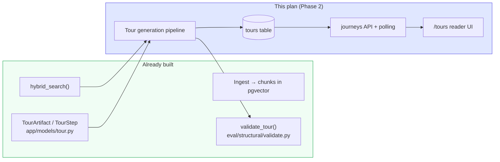
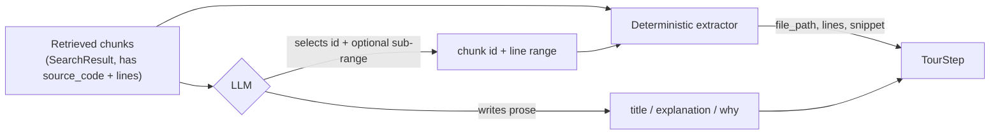
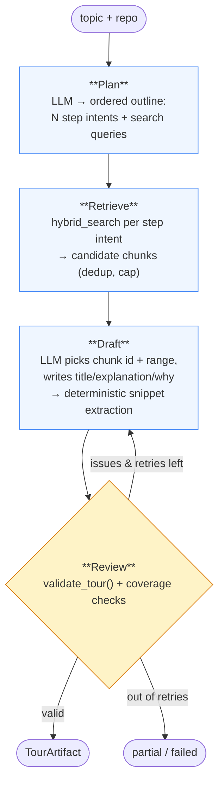
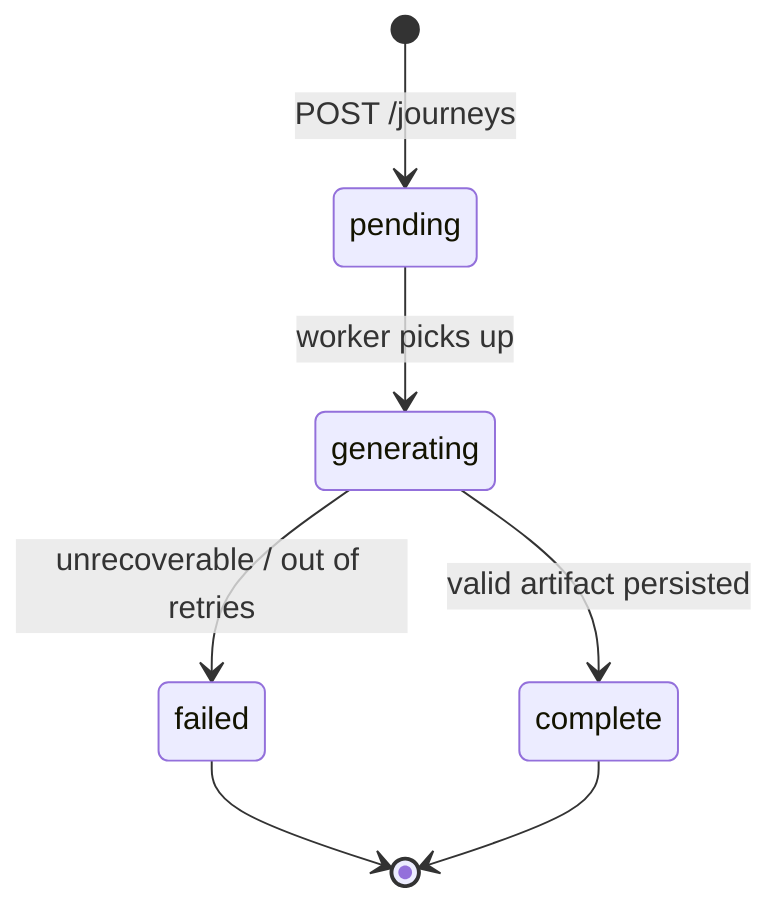
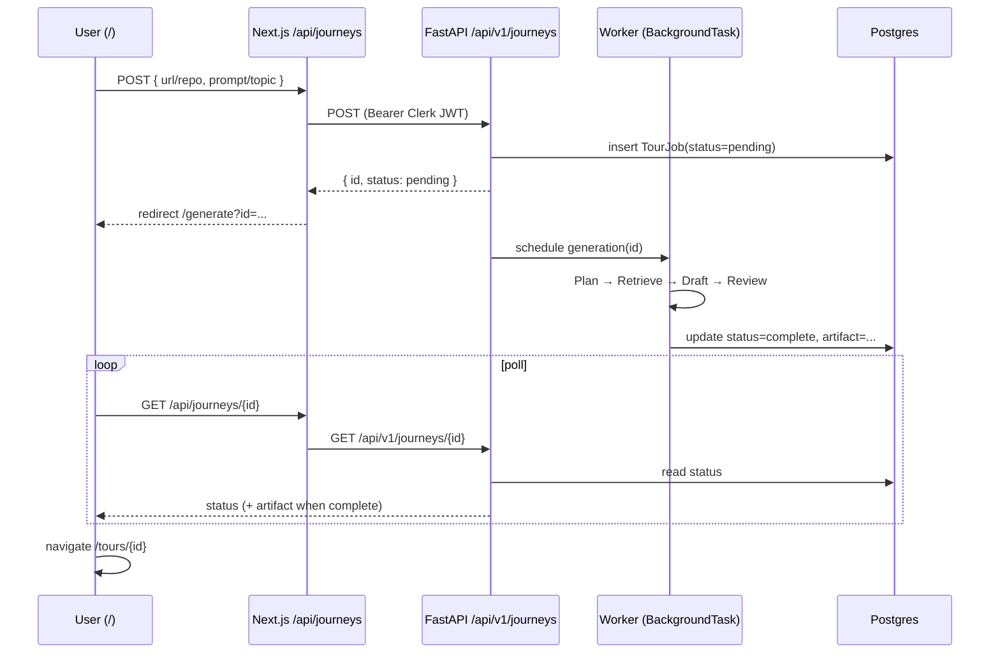

# Guided Tour Generation — Design & Plan (Phase 2)

Status: **proposal / not started.** This is the plan for turning the `/api/journeys`
stub into a real Plan → Retrieve → Draft → Review pipeline that emits a validated
`TourArtifact`, plus the persistence, API, and reader UI around it.

The goal of this doc is to nail the architecture and the sharp design decisions
*before* writing code, so the implementation is mostly mechanical.

---

## 1. What we're building

A **guided tour** is a structured, ordered walkthrough of an ingested repo for a
given topic ("authentication flow", "request lifecycle"). Each step points at real
code — file, line range, exact snippet — and explains *what* it does and *why* it
exists that way.

Today the app can only *answer questions* (`/explore` + ReAct agent). It cannot
*produce a tour*. The contract (`TourArtifact`/`TourStep`) and a no-LLM structural
validator (`validate_tour()`) already exist; the generator, persistence, endpoints,
and reader UI do not.

### Where it fits



---

## 2. The data contract (exists — reuse as-is)

```6:27:Backend/app/models/tour.py
class TourStep(BaseModel):
    title: str = Field(min_length=1)
    explanation: str = Field(min_length=1)
    file_path: str = Field(min_length=1)
    start_line: int = Field(ge=1)
    end_line: int = Field(ge=1)
    snippet: str = Field(min_length=1)
    why: str | None = None
    ...

class TourArtifact(BaseModel):
    title: str = Field(min_length=1)
    topic: str = Field(min_length=1)
    repo_name: str = Field(min_length=1)
    steps: list[TourStep] = Field(min_length=1)
```

This is the pipeline's output type and the reader UI's input type. No changes needed
to ship a first version.

---

## 3. The central design decision: snippets are *extracted*, never *generated*

The single biggest failure mode for a code-tour LLM is hallucinated citations —
inventing a `file_path`, wrong line numbers, or a snippet that doesn't match the
source. `validate_tour()` already catches these (`PATH_EXISTS`, `LINES_IN_BOUNDS`,
`SNIPPET_MATCHES`), but we'd rather **make them impossible by construction** than
detect-and-retry.

**Rule:** the LLM never writes a `snippet`, `file_path`, `start_line`, or `end_line`.
It only *selects* a retrieved chunk (by an opaque id we hand it) and optionally
narrows the line range within that chunk. We then derive the citation fields
deterministically from the stored `CodeChunkModel.source_code`:

- `file_path`, `start_line`, `end_line`, `language` ← chunk metadata
- `snippet` ← exact substring of the chunk's stored source for the chosen sub-range

The LLM authors only the prose fields it should own: `title`, `explanation`, `why`.

This means `SNIPPET_MATCHES` / `PATH_EXISTS` / `LINES_IN_BOUNDS` cannot fail for a
well-behaved generator. The Review node becomes a safety net, not the primary
grounding mechanism.



---

## 4. Pipeline architecture (LangGraph)

Mirror the existing `app/agent/` structure (`graph.py`, `runner.py`, `tools.py`,
`state.py`) in a new `app/tour/` package. Four nodes, one bounded repair loop.



### Node responsibilities

| Node | Input | Output | LLM? |
|---|---|---|---|
| **Plan** | topic, repo, (optional repo structure hints) | ordered list of `{step_intent, search_query}` | yes (structured output) |
| **Retrieve** | per-step queries | per-step candidate `SearchResult[]` (reuse `hybrid_search`, dedup by `chunk_id`) | no |
| **Draft** | step intent + candidate chunks | `TourStep` (prose from LLM, citation extracted) | yes (structured output) |
| **Review** | draft `TourArtifact` | `ValidationResult` + coverage flags | no |

### State

```python
# app/tour/state.py (sketch)
class TourState(TypedDict):
    topic: str
    repo_name: str
    installation_id: int
    plan: list[PlannedStep]          # step_intent + search_query
    candidates: dict[int, list[SearchResult]]  # plan index -> chunks
    steps: list[TourStep]
    issues: list[CheckIssue]
    attempts: int
```

### Key reuse

- `hybrid_search()` (`app/services/search.py`) — Retrieve node calls it directly, or
  wraps it in a tour-scoped tool like `build_hybrid_search_tool()`.
- `validate_tour_artifact()` (`eval/structural/validate.py`) — Review node. **Caveat
  below.**
- `ChatOpenAI` + structured output (`.with_structured_output(...)`) instead of the
  ReAct tool loop, since Plan and Draft have fixed shapes.

---

## 5. Validation at generation time (the one real gap)

`validate_tour_artifact()` checks steps against files **on disk** under a
`repo_root`. At generation time we have chunks **in Postgres**, not necessarily a
clone. Two options:

- **A — Validate against stored chunk source (recommended for v1).** Because snippets
  are extracted from `CodeChunkModel.source_code`, we can validate the snippet against
  the *same stored source* rather than a disk file. Add a
  `validate_tour_against_chunks(artifact, chunks_by_path)` sibling that mirrors the
  disk checks but reads from the DB. Keeps generation self-contained (no clone).
- **B — Keep a shallow clone from ingest and point `validate_tour()` at it.** Truer to
  "the repo as it exists," but couples generation to a working tree and re-clones.

Decision: **A for v1** (fast, no clone, and construction already guarantees grounding);
keep the disk-based `validate_tour()` as the offline/eval path. Revisit B if we want
to validate against files that were never chunked.

---

## 6. Persistence

New table, following existing SQLModel conventions (`app/models/github_connection.py`).
Store the artifact as JSON so the schema can evolve without migrations.

```python
# app/models/tour_job.py (sketch)
class TourJob(SQLModel, table=True):
    __tablename__ = "tour_jobs"
    id: uuid.UUID = Field(default_factory=uuid.uuid4, primary_key=True)
    userId: str = Field(index=True)
    installation_id: int
    repo_name: str = Field(index=True)
    topic: str
    status: str = Field(index=True)   # see state machine
    artifact: dict | None = Field(default=None, sa_column=Column(JSONB))
    error: str | None = None
    createdAt / updatedAt  # server_default=func.now(), onupdate=func.now()
```

### Job lifecycle



For v1, "worker" can be a FastAPI `BackgroundTasks` job in-process. The README already
plots SQS + a separate worker for Phase 3 — the status column and polling API are
designed so that swap is invisible to the frontend.

---

## 7. API

Backend (`app/api/journeys.py`, wired in `app/main.py`), auth via the existing Clerk
`get_authenticated_user_id` dependency, same ownership check as `app/api/agent.py`.

| Method | Path | Body / result |
|---|---|---|
| `POST` | `/api/v1/journeys` | `{ repoName, topic, userId }` → `{ id, status: "pending" }` |
| `GET`  | `/api/v1/journeys/{id}` | `{ id, status, artifact?, error? }` |
| `GET`  | `/api/v1/journeys?repo=` | list a user's tours (for a library view, optional) |

### Request → render sequence



---

## 8. Frontend

Replace the stub and add two pages. Reuse `/explore`'s markdown + `SourceCard`
rendering patterns.

| Route | State today | Plan |
|---|---|---|
| `/api/journeys` (proxy) | stub returns `"Success"` | proxy to backend, forward Clerk JWT, return `{ id }` |
| `/` home form | POSTs to stub | POST → get `id` → route to `/generate?id=` |
| `/generate` | not built | poll `GET /api/journeys/{id}`, show progress, redirect to reader on `complete` |
| `/tours/{id}` | not built | reader: TOC, per-step title/explanation/why, syntax-highlighted snippet with `file_path:start-end` |

Current stub for reference:

```3:12:Frontend/src/app/api/journeys/route.ts
export async function POST(req: Request) {
  try {
    const body = await req.json();
    const { url, prompt } = body;
    if (!url || url.length === 0) throw new Error(`Failure to process`);
    console.log("Generating journey for: ", url, " with prompt: ", prompt);
    return new NextResponse(`Success`, { status: 200 });
  } catch (error) { ... }
}
```

---

## 9. Evaluation

- **Structural eval (exists):** already validates fixtures. Add a fixture generated by
  the real pipeline once it runs, to lock the output shape.
- **LLM-as-judge (README todo):** faithfulness (does explanation match snippet?),
  relevance (does step serve the topic?), completeness (does the tour cover the
  topic?), ordering (do steps flow logically?). Run over a small topic set on the
  FastAPI hero repo.
- **Coverage check (cheap, no LLM):** every planned step produced a step; steps span
  ≥ N distinct files; no duplicate snippets.

---

## 10. Open questions / decisions to confirm

1. **Topic source** — free-text prompt only, or also auto-suggested topics from repo
   structure (README lists this as a separate todo)? *Assume free-text for v1.*
2. **Tour length** — fixed cap (e.g. 5–8 steps) or LLM-decided within a bound?
   *Assume bounded, model chooses within `[3, 8]`.*
3. **Model routing** — same `gpt-4o-mini` as the agent, or a stronger model for the
   Plan node? *Assume single model v1; leave a seam for cheap/expensive split.*
4. **Sync vs async** — `BackgroundTasks` in-process (v1) vs SQS worker (Phase 3).
   *Assume in-process with a polling API shaped for later SQS.*
5. **Validation target** — stored chunks (§5 option A) vs shallow clone (option B).
   *Assume A.*

---

## 11. Implementation milestones

- [x] **M1 — Generator core.** `app/tour/{state,schemas,prompts,extract,graph,runner}.py`;
      Plan → Retrieve → Draft over an already-ingested repo, with deterministic snippet
      extraction (grounding by construction). Unit tests in `tests/test_tour.py` (15,
      passing) and a live smoke eval `eval/run_tour_smoke_eval.py` that generates real
      tours and runs them through `validate_tour` (needs DB + `OPENAI_API_KEY`; not run
      here). Review/repair loop deferred to M2.
- [x] **M2 — Validation.** `validate_tour_against_chunks()` (`eval/structural/validate.py`,
      §5 option A) validates steps against stored chunk source, no clone. Review node
      (`app/tour/review.py`) combines those structural checks with coverage checks
      (every planned step produced, no duplicate citations, ≥ N distinct files) and is
      wired into the graph with a bounded Draft↔Review repair loop (`max_attempts`,
      default 2) that redrafts only flagged steps and stops early when remaining issues
      aren't repairable. `run_tour_smoke_eval.py --save-fixture NAME` persists a real
      generated artifact as a structural fixture + manifest entry to lock the output
      shape. Tests in `tests/test_tour.py` + `tests/test_structural_eval.py`.
- [ ] **M3 — Persistence + API.** `TourJob` model + table; `POST /api/v1/journeys`,
      `GET /api/v1/journeys/{id}`; `BackgroundTasks` runner; ownership checks.
- [ ] **M4 — Frontend.** Real `/api/journeys` proxy; `/generate` polling page;
      `/tours/{id}` reader with syntax highlighting + TOC.
- [ ] **M5 — Eval + docs.** LLM-as-judge harness; README/tracker updates; failure
      modes.

Milestones are independently shippable: M1–M2 make the pipeline runnable from a
script/eval; M3–M4 expose it in the product.
