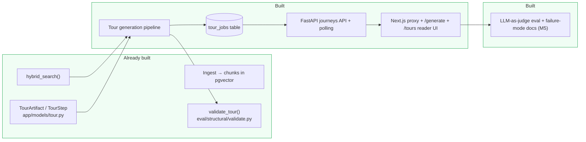
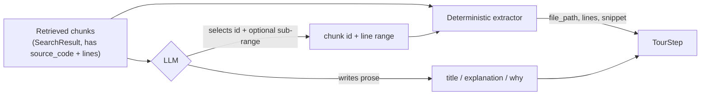
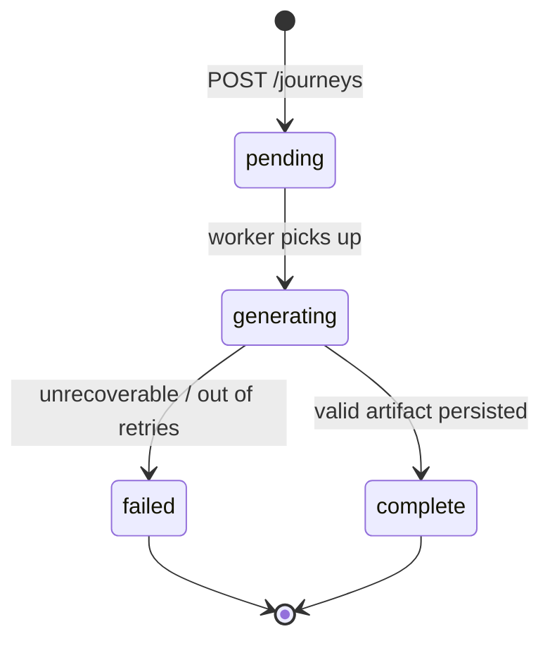
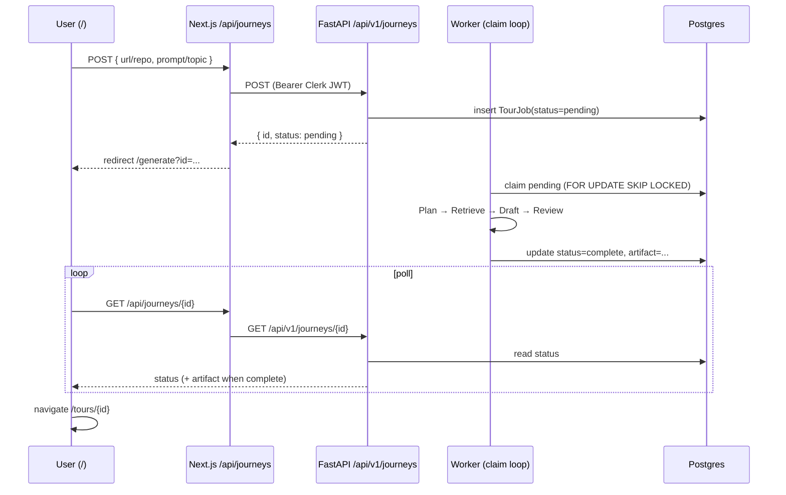

# Guided Tour Generation — Design & Plan (Phase 2)

Status: **end-to-end implemented, M5 landed.** The Plan → Retrieve → Draft → Review
generator, `TourJob` persistence, FastAPI journeys endpoints, and the Next.js frontend
(journeys proxy, `/generate` polling page, `/tours` library, and `/tours/{id}` reader)
all exist, and the M5 LLM-as-judge harness + failure-mode docs are now in place.

This doc is now both the Phase 2 design record and the current implementation tracker.
Earlier sections preserve the decisions; the milestones at the bottom show what has
landed and what is still open.

---

## 1. What we're building

A **guided tour** is a structured, ordered walkthrough of an ingested repo for a
given topic ("authentication flow", "request lifecycle"). Each step points at real
code — file, line range, exact snippet — and explains *what* it does and *why* it
exists that way.

Today the app can *answer questions* (`/explore` + ReAct agent), and the backend can
generate and persist grounded tours for already-ingested repos through
`/api/v1/journeys`. The frontend still cannot display or poll those tours: the
Next.js `/api/journeys` route remains a stub, and `/generate` / `/tours/{id}` are not
built yet.

### Where it fits



---

## 2. The data contract (exists — reuse as-is)

```6:27:Backend/app/models/tour.py
class TourStep(BaseModel):
    title: str = Field(min_length=1)
    explanation: str = Field(min_length=1)
    file_path: str = Field(min_length=1)
    start_line: int = Field(ge=1)
    end_line: int = Field(ge=1)
    snippet: str = Field(min_length=1)
    why: str | None = None
    ...

class TourArtifact(BaseModel):
    title: str = Field(min_length=1)
    topic: str = Field(min_length=1)
    repo_name: str = Field(min_length=1)
    steps: list[TourStep] = Field(min_length=1)
```

This is the pipeline's output type and the reader UI's input type. No changes needed
to ship a first version.

---

## 3. The central design decision: snippets are *extracted*, never *generated*

The single biggest failure mode for a code-tour LLM is hallucinated citations —
inventing a `file_path`, wrong line numbers, or a snippet that doesn't match the
source. `validate_tour()` already catches these (`PATH_EXISTS`, `LINES_IN_BOUNDS`,
`SNIPPET_MATCHES`), but we'd rather **make them impossible by construction** than
detect-and-retry.

**Rule:** the LLM never writes a `snippet`, `file_path`, `start_line`, or `end_line`.
It only *selects* a retrieved chunk (by an opaque id we hand it) and optionally
narrows the line range within that chunk. We then derive the citation fields
deterministically from the stored `CodeChunkModel.source_code`:

- `file_path`, `start_line`, `end_line`, `language` ← chunk metadata
- `snippet` ← exact substring of the chunk's stored source for the chosen sub-range

The LLM authors only the prose fields it should own: `title`, `explanation`, `why`.

This means `SNIPPET_MATCHES` / `PATH_EXISTS` / `LINES_IN_BOUNDS` cannot fail for a
well-behaved generator. The Review node becomes a safety net, not the primary
grounding mechanism.



---

## 4. Pipeline architecture (LangGraph)

Mirror the existing `app/agent/` structure (`graph.py`, `runner.py`, `tools.py`,
`state.py`) in a new `app/tour/` package. Four nodes, one bounded repair loop.


### Node responsibilities

| Node | Input | Output | LLM? |
|---|---|---|---|
| **Plan** | topic, repo, (optional repo structure hints) | ordered list of `{step_intent, search_query}` | yes (structured output) |
| **Retrieve** | per-step queries | per-step candidate `SearchResult[]` (reuse `hybrid_search`, dedup by `chunk_id`) | no |
| **Draft** | step intent + candidate chunks | `TourStep` (prose from LLM, citation extracted) | yes (structured output) |
| **Review** | draft `TourArtifact` | `ValidationResult` + coverage flags | no |

### State

```python
# app/tour/state.py (sketch)
class TourState(TypedDict):
    topic: str
    repo_name: str
    installation_id: int
    plan: list[PlannedStep]          # step_intent + search_query
    candidates: dict[int, list[SearchResult]]  # plan index -> chunks
    steps: list[TourStep]
    issues: list[CheckIssue]
    attempts: int
```

### Key reuse

- `hybrid_search()` (`app/services/search.py`) — Retrieve node calls it directly, or
  wraps it in a tour-scoped tool like `build_hybrid_search_tool()`.
- `validate_tour_artifact()` (`eval/structural/validate.py`) — Review node. **Caveat
  below.**
- `ChatOpenAI` + structured output (`.with_structured_output(...)`) instead of the
  ReAct tool loop, since Plan and Draft have fixed shapes.

---

## 5. Validation at generation time (the one real gap)

`validate_tour_artifact()` checks steps against files **on disk** under a
`repo_root`. At generation time we have chunks **in Postgres**, not necessarily a
clone. Two options:

- **A — Validate against stored chunk source (recommended for v1).** Because snippets
  are extracted from `CodeChunkModel.source_code`, we can validate the snippet against
  the *same stored source* rather than a disk file. Add a
  `validate_tour_against_chunks(artifact, chunks_by_path)` sibling that mirrors the
  disk checks but reads from the DB. Keeps generation self-contained (no clone).
- **B — Keep a shallow clone from ingest and point `validate_tour()` at it.** Truer to
  "the repo as it exists," but couples generation to a working tree and re-clones.

Decision: **A for v1** (fast, no clone, and construction already guarantees grounding);
keep the disk-based `validate_tour()` as the offline/eval path. Revisit B if we want
to validate against files that were never chunked.

---

## 6. Persistence

Implemented in `app/models/tour_job.py`, following existing SQLModel conventions and
storing the artifact as JSONB so the schema can evolve without migrations.

```python
# app/models/tour_job.py
class TourJob(SQLModel, table=True):
    __tablename__ = "tour_jobs"
    id: int | None = Field(default=None, primary_key=True)
    userId: str = Field(index=True)
    installation_id: int
    repo_name: str = Field(index=True)
    topic: str
    status: str = Field(index=True)   # see state machine
    artifact: dict | None = Field(default=None, sa_column=Column(JSONB))
    error: str | None = None
    createdAt / updatedAt  # server_default=func.now(), onupdate=func.now()
```

### Job lifecycle



For v1, the worker is an in-process polling loop (`app/worker.py`) that claims
pending `tour_jobs` rows with `FOR UPDATE SKIP LOCKED`. A dedicated
`python -m app.worker` process is safe to run alongside the API. The polling API
is unchanged, so a later SQS swap stays invisible to the frontend.

---

## 7. API

Backend (`app/api/journeys.py`, wired in `app/main.py`), auth via the existing Clerk
`get_authenticated_user_id` dependency, same ownership check as `app/api/agent.py`.

| Method | Path | Body / result |
|---|---|---|
| `POST` | `/api/v1/journeys` | `{ repoName, topic, userId }` → `{ id, status: "pending" }` |
| `GET`  | `/api/v1/journeys/{id}` | `{ id, status, artifact?, error? }` |
| `GET`  | `/api/v1/journeys?repo=` | list a user's tours (for a library view, optional) |

### Request → render sequence



---

## 8. Frontend

Implemented. Replaced the stub proxy and added the polling + reader + library pages,
reusing `/explore`'s markdown + `SourceCard` rendering patterns.

| Route | State today | Plan |
|---|---|---|
| `/api/journeys` (proxy) | done | `POST` create + `GET` list, forward Clerk JWT + inject `userId`, return backend JSON |
| `/api/journeys/[id]` (proxy) | done | `GET` poll one job (Bearer only) |
| `/` home form | done | POST `{ repoName, topic }` → read `{ id }` → route to `/generate?id=` |
| `/generate` | done | poll `GET /api/journeys/{id}` every 2s, show progress, redirect to reader on `complete`, show `error` on `failed` |
| `/tours` | done | library list of a user's jobs with status badges |
| `/tours/{id}` | done | reader: sticky TOC, per-step title/explanation/why, line-numbered snippet with `file_path:start-end` (plain `<pre>`; no highlighter dep) |

The stub was replaced by a real proxy (`POST` create + `GET` list) that forwards the
Clerk JWT and injects `userId`, mirroring `api/agent/ask`:

```18:31:Frontend/src/app/api/journeys/route.ts
    const backend_url = process.env.BACKEND_URL ?? "http://127.0.0.1:8000";

    const response = await fetch(`${backend_url}/api/v1/journeys`, {
      method: "POST",
      headers: {
        "Content-Type": "application/json",
        Authorization: `Bearer ${token}`,
      },
      body: JSON.stringify({
        repoName,
        topic,
        userId,
      }),
    });
```

---

## 9. Evaluation

Three layers, cheapest first, each catching what the one below it can't:

- **Coverage check (cheap, no LLM):** every planned step produced a step; steps span
  ≥ N distinct files; no duplicate snippets. Lives in `app/tour/review.py` and gates
  the repair loop at generation time.
- **Structural eval (no LLM):** does the artifact parse, reference real files, and quote
  matching source? `eval/run_structural_eval.py` over hand-written + pipeline-captured
  fixtures. Grounding is by construction, so this is a regression guard.
- **LLM-as-judge (M5, implemented):** scores the qualities structure can't see —
  **faithfulness** (does the explanation match its snippet?), **relevance** (does the
  step serve the topic?), **completeness** (does the tour cover the topic?), and
  **ordering** (do steps flow logically?).

### LLM-as-judge harness (built from scratch)

We chose to build this from scratch rather than adopt an external eval library
(ragas / deepeval / promptfoo / LangSmith): the existing harnesses are already a
consistent, dependency-free mini-framework (per-item dataclass → `_aggregate` →
`_print_report` + `--json/--out/--strict`), the judge dimensions are code-tour-specific
rather than generic RAG QA, and the pipeline already uses
`ChatOpenAI.with_structured_output(...)` — exactly what a structured judge needs.

- **Rubric + judge** — `eval/judge/`: `schemas.py` (`TourJudgment` / `StepScore`, 1-5
  integer scores), `prompts.py` (rubric anchors per dimension), `judge.py`
  (`judge_tour()` = one structured-output call over the whole tour, plus `summarize()`
  which averages per-step dims and passes tour-level dims through to an `overall` mean).
- **Harness** — `eval/run_tour_judge_eval.py`, mirroring `run_tour_smoke_eval.py`. Two
  sources of tours: **live** (generate per topic via `generate_tour`, needs DB + OpenAI)
  or **`--from-fixture NAME`** (judge a saved artifact only — OpenAI, no DB). Isolates
  per-topic generation/judge failures as `harness_errors` (kept out of the score
  averages), aggregates per-dimension means, and gates CI via `--strict --min-score`
  (default 3.5). `--judge-model` lets the judge differ from the generator to reduce
  self-preference bias.
- **Tests** — `tests/test_tour_judge.py` (8, passing) cover score reduction, the judge
  call wiring (via a fake structured-output model), and aggregation/threshold logic
  with no LLM or DB.

One judge call scores a whole tour so the model reasons about completeness/ordering with
every step in context; per-step scores come back as an ordered list aligned to
`TourArtifact.steps` (extra entries are dropped so a chatty model can't skew averages).

A committed reference run lives in `eval/judge_baseline.json` (FastAPI `0.115.6`,
`gpt-4o-mini`) to diff future runs against; refresh it with
`run_tour_judge_eval --out eval/judge_baseline.json`. First baseline: overall **4.44**,
with completeness (**3.67**) the weakest dimension — expected, since grounding is free by
construction but topic *coverage* is the hard part.

---

## 10. Open questions / decisions to confirm

1. **Topic source** — free-text prompt only, or also auto-suggested topics from repo
   structure (README lists this as a separate todo)? *Assume free-text for v1.*
2. **Tour length** — fixed cap (e.g. 5–8 steps) or LLM-decided within a bound?
   *Assume bounded, model chooses within `[3, 8]`.*
3. **Model routing** — same `gpt-4o-mini` as the agent, or a stronger model for the
   Plan node? *Assume single model v1; leave a seam for cheap/expensive split.*
4. **Sync vs async** — Postgres-backed claim loop (v1) vs SQS worker (later).
   *Assume DB queue with a polling API shaped for later SQS.*
5. **Validation target** — stored chunks (§5 option A) vs shallow clone (option B).
   *Assume A.*

---

## 11. Implementation milestones

- [x] **M1 — Generator core.** `app/tour/{state,schemas,prompts,extract,graph,runner}.py`;
      Plan → Retrieve → Draft over an already-ingested repo, with deterministic snippet
      extraction (grounding by construction). Unit tests in `tests/test_tour.py` (15,
      passing) and a live smoke eval `eval/run_tour_smoke_eval.py` that generates real
      tours and runs them through `validate_tour` (needs DB + `OPENAI_API_KEY`; not run
      here). Review/repair loop deferred to M2.
- [x] **M2 — Validation.** `validate_tour_against_chunks()` (`eval/structural/validate.py`,
      §5 option A) validates steps against stored chunk source, no clone. Review node
      (`app/tour/review.py`) combines those structural checks with coverage checks
      (every planned step produced, no duplicate citations, ≥ N distinct files) and is
      wired into the graph with a bounded Draft↔Review repair loop (`max_attempts`,
      default 2) that redrafts only flagged steps and stops early when remaining issues
      aren't repairable. `run_tour_smoke_eval.py --save-fixture NAME` persists a real
      generated artifact as a structural fixture + manifest entry to lock the output
      shape. Tests in `tests/test_tour.py` + `tests/test_structural_eval.py`.
- [x] **M3 — Persistence + API.** `TourJob` model + `tour_jobs` table
      (`app/models/tour_job.py`, artifact stored as JSONB, `TourJobStatus`
      pending→generating→complete/failed; int PK per existing SQLModel convention
      rather than the uuid sketch in §6). `app/api/journeys.py` wired at
      `/api/v1/journeys` in `main.py`: `POST` (create job + schedule background
      generation → `{id, status}`), `GET /{id}` (poll, with ownership check), and
      `GET ?repo=` (list a user's jobs). In-process `BackgroundTasks` runner
      (`_run_generation`) opens its own session, calls `generate_tour`, and persists
      `complete`+artifact or `failed`+error (catches `TourGenerationError`). Auth +
      `installationId` resolution mirror `app/api/agent.py`. Route tests in
      `tests/test_journeys_route.py` (11, passing).
- [x] **M4 — Frontend.** Real `/api/journeys` proxy (`POST` create + `GET` list) and
      `/api/journeys/[id]` (`GET` poll), all forwarding the Clerk JWT and injecting
      `userId`, mirroring `api/agent/ask`. Home form now sends `{ repoName, topic }`,
      reads `{ id }`, and routes to `/generate?id=`. `/generate` polls
      `GET /api/journeys/{id}` every 2s with a pending→generating→complete progress
      indicator, redirects to the reader on `complete`, and surfaces `error` on
      `failed`. `/tours/{id}` reader renders the `TourArtifact`: sticky TOC, per-step
      title/explanation (markdown)/why callout, and a citation block with
      `file_path:start-end` + line-numbered snippet (plain `<pre>`; no highlighter dep
      added). `/tours` library lists a user's jobs with status badges. Shared TS types
      in `src/types/tour.ts`. `tsc --noEmit` and `eslint` clean.
- [x] **M5 — Eval + docs.** LLM-as-judge harness (`eval/judge/` + `eval/run_tour_judge_eval.py`,
      §9): a single structured-output judge call scores each tour on faithfulness /
      relevance (per step) and completeness / ordering (per tour), 1-5; `summarize()`
      reduces to per-dimension means + an `overall`. Runs **live** (generate + judge) or
      **`--from-fixture`** (judge a saved artifact, no DB); `--strict --min-score` gates
      CI and `--judge-model` decouples the judge from the generator.       Built from scratch
      (no external eval lib) to match the existing harness conventions. Tests in
      `tests/test_tour_judge.py` (8, passing). Committed reference run in
      `eval/judge_baseline.json` (overall 4.44). Known limitations + failure modes below.
- [x] **M6 — Durable job queue.** `POST /journeys` only inserts `pending`; `app/worker.py`
      claims with `FOR UPDATE SKIP LOCKED`, runs `generate_tour`, and recovers stale
      `generating` rows after a lease timeout. Gated by `RUN_WORKER` (default on in the
      API process; `python -m app.worker` is also safe). Tests in `tests/test_worker.py`
      plus optional Postgres claim tests (`TEST_DATABASE_URL`).

Milestones are independently shippable: M1–M2 make the pipeline runnable from a
script/eval; M3–M4 expose it in the product; M5 adds the qualitative eval + docs;
M6 makes generation survive process restarts.

---

## 12. Known limitations & failure modes

**Grounding vs. quality.** Snippets are extracted, never generated (§3), so hallucinated
citations are impossible by construction and the structural eval enforces it. That says
nothing about whether the *prose* is correct or the tour is *useful* — that's what the
LLM-as-judge covers, and it's a softer signal.

**The judge is imperfect.** It's a single model scoring with a rubric, so treat its
scores as a directional regression signal, not ground truth:
- *Self-preference / correlated blind spots* — when the judge and generator are the same
  model, both can share a misconception and the judge won't flag it. Mitigation:
  `--judge-model` to run a different/stronger judge; revisit with a second judge or
  human spot-checks if scores are load-bearing.
- *Scale compression* — LLM judges cluster around 3-4 and rarely emit 1s or 5s, so small
  real regressions can hide inside the noise. `--min-score` is deliberately a floor, not
  a target; watch trends across runs rather than a single number.
- *Snippet-bounded view* — faithfulness is judged only against the cited snippet. A
  step whose explanation is true of the wider file but unsupported by the shown lines is
  penalised (arguably correct), and a step relying on off-snippet context can't be fully
  assessed.
- *Non-determinism* — even at `temperature=0`, scores can vary run to run; a single point
  isn't a stable baseline.

**Pipeline failure modes the eval surfaces (not fixes):**
- *Thin retrieval* — if `hybrid_search` returns weak candidates for a step intent, the
  drafter picks the closest chunk and stays honest but narrow; this shows up as low
  relevance/completeness, not a structural failure.
- *Coverage repair exhaustion* — the Draft↔Review loop is bounded (`max_attempts`), so a
  persistently uncovered plan step is surfaced as a warning and the tour ships partial
  rather than failing (see `runner.generate_tour`).
- *Topic drift* — a vague topic yields a vague plan; the judge's relevance/completeness
  scores are the main signal here since structure still passes.

**Scope caps.** Live eval runs a small topic set against the single pinned FastAPI
fixture (`0.115.6`); it is a smoke/regression harness, not a broad benchmark. Multi-repo
coverage, a larger topic bank, and human-rated calibration are future work.

---

## 13. Future improvements

**Shared BFF proxy/auth wrapper (frontend).** The Next.js proxy routes under
`Frontend/src/app/api/journeys/**` each repeat the same boilerplate: resolve Clerk auth,
check `isAuthenticated`/token, read `BACKEND_URL`, `fetch` the backend with a bearer
token, and forward the JSON. This duplication is also where the current per-file error
handling collapses auth/validation/backend-4xx into a generic `500`. As more
backend-for-frontend routes are added (e.g. delete/re-run a tour, list repos, user
settings), extract a single helper — a `withAuth` / `proxyToBackend` wrapper — that
centralizes auth resolution, correct status-code propagation (401/400/backend status vs.
a real 500), and the fetch/forward plumbing. Every existing and future route then gets
consistent, correct error semantics for free instead of copy-pasting the same pattern
(and the same bug). Deferred for now since journeys is the only proxy surface; revisit
when a second family of routes lands.
